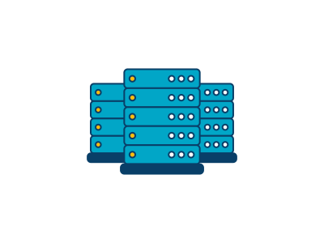

# Introduction to Cloud Computing
The concept of cloud computing has been around since the 1960s and the idea originated from the requirement of scalability in computer's resources like network, menory, disk etc. Like the following graph explaind on how PCs scalled to data centers.

With many data centers in many location around the world, and the ability to allow user to deploy its services to one or many data centers over the Internet Clould computing finally introduced to the world.

> Cloud computing is a model for enabling convenient, on-demand network access to a shared pool of configurable computing resources (e.g., networks, servers, storage, applications, and services) that can be rapidly provisioned and released with minimal management effort or service provider interaction - NIST.

### What's in a data center?

Data center is a place that centralized raw computing resources for processing request, serve applications and store data. Network is the key factor for data center to delivery required services. Each data center have some key characteristic

1. Least one emergency power supplies
2. Big cooling system
3. High power consumption: How to reduce energy is one of the major concern for Clould providers

## What is the need of clould computing

In classical scaling techniques, scaling up/down raw computer resources is very difficult. But the resources required by server can vary considerably, so user generally allocate more resources to coping with emergent situation. By research server utilization in existing data centers ~5%-20%. Hence, this leads to a dilemma for the organization to choose between wasting resources (money) or losing customers (profits that should be earned disappear).

#### Difficulities in scalling
`Scale Up`:
1. Need to order new machines, install them, integrate with existing cluster - can take weeks
2. Large scaling factors may require major redesign, e.g. new storage system, new interconnect, new building

`Scaling Down`:
1. What to do with superfluous hardware?
2. Server idle power is about 60% of peak → Energy is consumed even when no work is being done
3. Many fixed costs, such as construction

Another problem with classical clusters and data centers is the cost to build and maintain. For example [Mircosoft New Data Canter](https://www.datacenterknowledge.com/archives/2010/08/27/microsoft-picks-virginia-for-major-data-center#:~:text=Microsoft%20data%20center.-,Microsoft%20has%20selected%20a%20site%20near%20Boydton%2C%20Virginia%20for%20a,hub%20for%20Microsoft's%20online%20services.) invested $499 million for a signle data center. And maintenance require IT expertises, faulty replacement etc, and operation cost require energy, special software etc.

## Types of cloud computing

### Public cloud

Public cloud is designed for wide range of users, individuals or businesses. Public cloud provider like AWS, Azure provides users with raw computing resources through the Internet. All the raw computing resources are owned and managed by cloud providers.

### Private cloud

Private cloud provides a specially designed cloud environment for a business or organization, the resources and accessibility can only be used/access by the owners. So the organization can have more control over its computing resources, also more secure due to another layer of firewall and private network. The private cloud can be located in organization's data center or managed by hird-party service providers to host their private cloud

### Hybrid cloud

Combine Public and Private cloud, allow data and services shared between two clould through network. Thus more flexibility in deploy applications, for example highly confidential data and service can be stored in private cloud, and general application deployed in public cloud.

> Q: Is Private and Hybrid is a real clould?

## Types of services provided by cloud - Everything as a Service

### Infrastructure as a service (IaaS)
Cloud providers provide off-site servers, storage, networking, and virtualization software - in most cases, some cloud providers like AWS provide the option to run OS without virtualization, only your OS in that server. At this level, users pay a minimal amount of money, with the highest level of flexibility, conversely, it requires IT knowledge to manage and operate.

### Platform as a service (PaaS)
Remove the requirement in understanding OS, and runtime knowledge, so users can focus on the delivery of products. As no need to consider scallibility, performance, environment and other pre-deployment process, which is time consuming.

Some mega PaaS providers are Microsoft Azure, Shopify, Heroku.

### Software as a service (SaaS)

User only need to use the product developed and maintained by cloud provider to produce business value. The difference between traditional software tool, is SaaS product is charge on-demand, instantly available when needed and access through internet.

