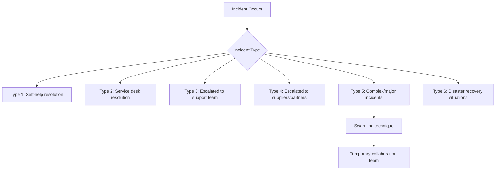

# ITIL 4 Management Practices: Incident, Problem, Service Request & Service Desk - Detailed Notes

## 1. Incident Management

### 1.1 Purpose
**To minimize the negative impact of incidents by restoring normal service operation as quickly as possible**

### 1.2 Key Term: Incident
**Definition**: An unplanned interruption to a service or a reduction in the quality of a service

### 1.3 Key Processes and Guidance
- **Incident Categorization**: Design for different types including:
  - Major incidents
  - Information security incidents
  - Varying impact levels
- **Prioritization**: Resolve higher business impact incidents first
- **Target Resolution Times**: Must be agreed, documented and communicated
- **Linking**: Connect incidents to CIs, changes, problems, known errors and knowledge

### 1.4 Incident Management Tools
Modern tools should provide:
- Automated matching of incidents to related incidents, problems or known errors
- Intelligent analysis of incident data
- Recommendations for future incidents
- Collaboration capabilities for effective teamwork

### 1.5 Incident Types and Resolution Paths

### 1.6 Collaboration in Incident Management
- **Swarming**: Multiple stakeholders work together initially until the right resolver is identified
- **Third-party Support**: Requires aligned support agreements for external components
- **Information Sharing**: Tools should facilitate sharing of symptoms, actions, affected CIs

### 1.7 Service Value Chain Contribution
- **High Contribution**: Deliver & support
- **Medium Contribution**: Improve
- **Low Contribution**: Plan, Engage, Design & transition, Obtain/build

## 2. Problem Management

### 2.1 Purpose
**To reduce the likelihood and impact of incidents by identifying actual and potential causes of incidents and managing workarounds and known errors**

### 2.2 Key Terms
| Term | Definition |
|------|------------|
| **Problem** | A cause, or potential cause, of one or more incidents |
| **Known Error** | A problem that has been analysed but has not been resolved |
| **Workaround** | A solution that reduces or eliminates the impact of an incident or problem for which a full resolution is not yet available |

### 2.3 Problem Management Phases

#### 2.3.1 Problem Identification
- Trend analysis of incident records
- Detection of duplicate and recurring issues
- Identification during major incident management
- Analysis of information from suppliers and partners
- Input from internal teams (developers, testers, projects)

#### 2.3.2 Problem Control
- Problem analysis
- Documenting workarounds
- Known error management

#### 2.3.3 Error Control
- Manage known errors
- Identify potential permanent solutions
- Regular re-assessment of known errors
- Impact assessment on customers
- Evaluation of resolution availability and cost

### 2.4 Interfaces with Other Practices
- Risk management
- Knowledge management
- Change enablement
- Continual improvement

### 2.5 Service Value Chain Contribution
- **High Contribution**: Improve
- **Medium Contribution**: Design & transition, Deliver & support
- **Low Contribution**: Plan, Engage, Obtain/build

## 3. Service Request Management

### 3.1 Purpose
**To support the agreed quality of a service by handling all predefined, user-initiated service requests in an effective and user-friendly manner**

### 3.2 Key Term: Service Request
**Definition**: A request from a user or user's authorized representative that initiates a service action agreed as a normal part of service delivery

### 3.3 Scope and Examples
Service requests may include:
- Service delivery actions
- Information provision
- Resource or service provision
- Access to resources or services
- Feedback, compliments, and complaints

### 3.4 Request Fulfillment Guidelines
1. **Standardization**: Steps should be well-known and proven
2. **Automation**: Standardize and automate to greatest degree possible
3. **Approval Policies**: Establish policies for limited/no approval requests
4. **Realistic Expectations**: Set clear timelines based on organizational capability
5. **Proper Routing**: Document and redirect misclassified requests (incidents/changes)
6. **Continuous Improvement**: Identify opportunities for faster fulfillment

### 3.5 Methods of Fulfillment
- **Service Catalog**: Central source for service offerings
- **Automation**: Self-service fulfillment where possible
- **Examples**: Client software installation, virtual server provision

### 3.6 Service Value Chain Contribution
- **High Contribution**: Deliver & support
- **Medium Contribution**: Engage
- **Low Contribution**: Plan, Design & transition, Obtain/build, Improve

## 4. Service Desk

### 4.1 Purpose
**To capture demand for incident resolution and service requests. It should also be the entry point and single point of contact for the service provider with all its users**

### 4.2 Key Aspects of a Good Service Desk
- **User Experience**: Major influence on perception of service provider
- **Business Understanding**: Practical knowledge of organization, processes and users
- **Value Addition**: Understand and act on business needs
- **Empathetic Links**: Provide informed connections between provider and users

### 4.3 Service Desk Provisions
**Communication Channels**:
- Phone calls, IVR, conference calls
- Service portals, mobile apps
- Social media, discussion forums
- Chat functions, live chat, chatbots

**Support Tools**:
- Intelligent telephony systems
- Workflow systems for routing and escalation
- Knowledge base
- Configuration management systems
- Remote access tools
- Dashboard and monitoring tools

### 4.4 Service Desk Staff Skills
- Excellent customer service skills
- Empathy and emotional intelligence
- Incident analysis and prioritization
- Effective communication
- Technical knowledge

### 4.5 Automation Benefits
- Captures and redirects out-of-scope issues
- Provides one-stop shop for requests
- Creates positive customer experience

### 4.6 Service Value Chain Contribution
- **High Contribution**: Engage
- **Medium Contribution**: Deliver & support
- **Low Contribution**: Plan, Design & transition, Obtain/build, Improve

## 5. Exam Preparation Summary

### 5.1 Must-Know Purpose Statements
- **Incident Management**: Minimize negative impact by restoring normal service
- **Problem Management**: Reduce likelihood/impact by identifying causes
- **Service Request Management**: Handle predefined requests effectively
- **Service Desk**: Capture demand and be single point of contact

### 5.2 Key Term Definitions
| Term | Definition |
|------|------------|
| **Incident** | Unplanned interruption or quality reduction |
| **Problem** | Cause or potential cause of incidents |
| **Known Error** | Analyzed but unresolved problem |
| **Workaround** | Temporary reduction/elimination of impact |
| **Service Request** | Predefined user-initiated service action |

### 5.3 Practice Interactions
- Service Desk captures incidents and requests
- Incident Management restores service quickly
- Problem Management identifies root causes
- All practices contribute to Continual Improvement

---
**Copyright Notice**: Based on PeopleCert ITIL® 4 Foundation materials. Copyright © 2025 PeopleCert International Limited. All rights reserved.