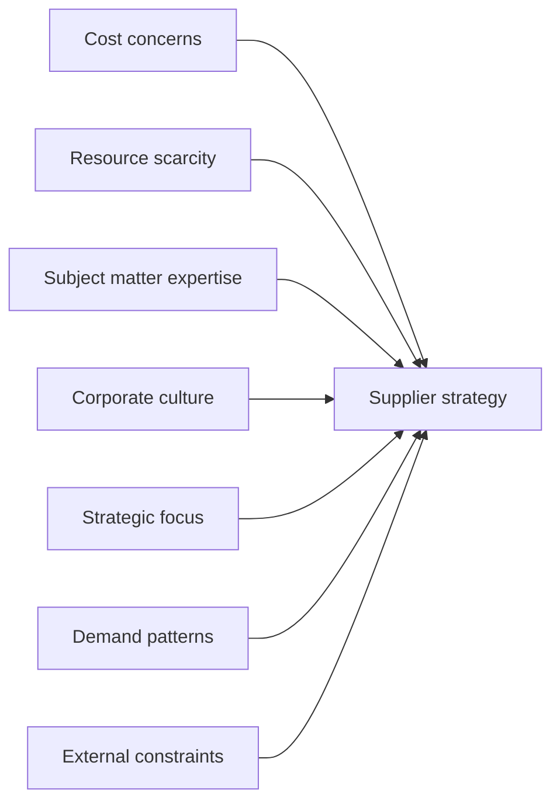

# ITIL 4 Four Dimensions of Service Management - Detailed Notes

## 1. Overview of the Four Dimensions

### 1.1 Core Concepts
- **Definition**: The four dimensions are critical components for the effective and efficient facilitation of value for customers and other stakeholders
- **Holistic Approach**: Supports a comprehensive approach to service management
- **Interrelationship**: These dimensions are interconnected and collectively form the foundation of service management

### 1.2 Key Characteristics
- **Permeable Boundaries**: Dimensions do not have sharp boundaries and may overlap
- **Complex Interactions**: May interact in unpredictable ways depending on complexity and uncertainty levels
- **Comprehensive Requirement**: Failure to address all four dimensions properly may result in:
  - Undeliverable services
  - Unmet expectations
  - Compromised value creation

## 2. Dimension 1: Organizations and People

### 2.1 Core Components
- **Formal organizational structures**: Hierarchy and reporting relationships
- **Rules and responsibilities**: Defined roles and accountability
- **Organizational culture**: Shared values and behavioral norms
- **Staffing requirements**: Necessary personnel and competencies
- **Skill requirements**: Required capabilities and expertise

### 2.2 Importance of Organizational Culture
- **Cultural Definition**: Values shared by a group, including:
  - Behavioral expectations
  - Shared ideas and beliefs
  - Common practices
- **Cultural Necessity**: Structures and systems of authority alone are insufficient for organizational effectiveness

### 2.3 Requirements for Supportive Culture
| Element | Description | Importance |
|---------|-------------|------------|
| **Shared values and attitudes** | Culture that supports organizational objectives | Foundation for behavior |
| **Leadership advocacy** | Leaders champion values that motivate desired behaviors | Drives appropriate actions |
| **Trust and transparency** | Open and honest work environment | Builds collaboration foundation |
| **Effective communication** | Clear information exchange and feedback mechanisms | Ensures alignment |

### 2.4 Critical Focus Areas
- **Communication and collaboration**: Ensuring information flow and teamwork
- **Skills and competencies development**:
  - Broad knowledge base
  - Deep specialization
- **Management and leadership styles**: Adaptive leadership approaches

### 2.5 Organizational Complexity Challenges
- **Growing complexity**: Modern organizations face increasingly complex environments
- **Management requirements**:
  - Well-defined structures and management approaches
  - Clear roles and responsibilities
  - Effective authority and communication systems
  - Support for overall strategy and operating model

## 3. Dimension 2: Information and Technology

### 3.1 Scope of Application
- **Dual applicability**: 
  - Applies to service management itself
  - Applies to services being managed

### 3.2 Key Considerations
1. **Information Management**
   - What information is managed by services?
   - What supporting information and knowledge is needed?
   - How to protect and manage information assets?

2. **Lifecycle Management**
   - Archiving strategies
   - Disposal methods and standards

### 3.3 Information Architecture Requirements
- **Continuous optimization**: Requires ongoing improvement to support information use and exchange
- **Critical quality attributes**:
  - Availability
  - Reliability
  - Accessibility
  - Timeliness
  - Accuracy
  - Relevance

### 3.4 Significance of Information
- **Value enablement**: For many services, information management is the primary means of enabling customer value
- **Service output**: Information is typically the key output of IT services consumed by business customers

### 3.5 Challenges and Constraints
- **Security and compliance**: Significant management challenges
- **Regulatory constraints**: 
  - Legal and regulatory requirements impose constraints
  - Influence organizational policies and practices
  - Vary across industries and countries

### 3.6 Technology Dependencies and Selection
**Innovative Technologies**:
- Blockchain
- Artificial intelligence
- Cognitive computing

**Common Practices**:
- Cloud computing
- Mobile applications

**Technology Selection Factors**:
- Organizational culture
- Business nature
- Strategic objectives

## 4. Dimension 3: Partners and Suppliers

### 4.1 Core Concept
- **Relationship management**: An organization's relationships with other organizations
- **Involvement scope**: May participate in various service stages:
  - Design → Development → Deployment → Delivery → Support → Continual improvement
- **Agreement framework**: Includes contracts and other formal agreements

### 4.2 Spectrum of Cooperation Forms

**Table: Organizational Relationship Types**

| Cooperation Form | Outputs | Output Responsibility | Outcome Responsibility | Formality Level | Examples |
|-----------------|---------|----------------------|-----------------------|----------------|----------|
| **Goods supply** | Supplied goods | Supplier | Customer | Formal contracts/invoices | Computer and phone procurement |
| **Service delivery** | Delivered services | Provider | Customer | Formal agreements | Cloud computing (IaaS/PaaS) |
| **Service partnership** | Co-created value | Shared | Shared | Shared goals/flexible agreements | Employee onboarding (HR, facilities, IT collaboration) |

### 4.3 Supplier Strategy Influencing Factors

### 4.4 Service Integration & Management (SIAM)
- **Definition**: A method to address the partners and suppliers dimension
- **Core mechanism**: Uses a specially established integrator to coordinate service relationships
- **Implementation approaches**:
  - Maintain SIAM capability internally
  - Delegate to trusted partners
- **Primary purpose**: Ensures coordination in multi-supplier environments

### 4.5 Relationship Management
- **Integration levels**: Range from formal contracts to flexible partnerships
- **Responsibility spectrum**: From clear separation to shared goals and risks
- **Strategic alignment**: Organization's role depends on its sourcing strategy and objectives

## 5. Dimension 4: Value Streams and Processes

### 5.1 Core Definition
- **Activities definition**: Specifies the activities, workflows, controls, and procedures needed to achieve agreed objectives
- **Dual applicability**: Applies to both the Service Value System (SVS) and specific products/services

### 5.2 Value Stream Concept
- **Step sequence**: A series of steps an organization undertakes to create and deliver products and services
- **Activity types**:
  - Value-adding activities
  - Non-value-adding activities (waste)
- **Visualization**: Represents journeys through service value chain activities for specific scenarios

### 5.3 Process Concept
- **Interrelated activities**: A set of interacting activities with defined sequences
- **Transformation focus**: Converts inputs into defined outputs
- **Dependencies**: Includes defined action sequences and dependencies

### 5.4 Key Focus Areas
- **Activity organization**: How activities are organized for efficient and effective value creation
- **Integrated operation**: How organization parts work together to enable value creation
- **Service value chain**: Generic operating model with different activity patterns (value streams)

### 5.5 Critical Design Questions
1. **Service model**: What is the generic delivery model and how does the service work?
2. **Value streams**: What value streams deliver the agreed service outputs?
3. **Performance**: Who or what performs the required service actions?

### 5.6 Value Stream Examples
- **New capability**: Need for new product/service feature to increase business efficiency
- **Access request**: Request for team member to access a product or service
- **Capacity expansion**: Request for new infrastructure capacity to maintain normal operation

**Sample Value Stream**: Start → Gather requirements → Design new service → Build new service → Launch new service → End

## 6. External Factors: PESTLE Analysis

### 6.1 Environmental Context
- **Non-isolation**: Service providers do not operate in isolation
- **Dynamic environment**: Work in complex, volatile, and uncertain environments
- **Constraint imposition**: External factors impose constraints on service provider operations

### 6.2 PESTLE Framework
- **Political**: Government policies, political stability, regulations
- **Economic**: Growth patterns, exchange rates, economic conditions
- **Social**: Demographic trends, lifestyle changes, cultural aspects
- **Technological**: Innovation pace, automation, internet accessibility
- **Legal**: Employment legislation, consumer laws, regulatory requirements
- **Environmental**: Climate change, renewable energy, weather patterns

### 6.3 Impact on Dimensions
- **Resource configuration**: Influences how organizations configure their resources
- **Dimension addressing**: Affects how organizations address the four dimensions
- **Strategic consideration**: Requires analysis for service provider selection and operation

## 7. Key Learning Points

### 7.1 Four Dimensions Summary
1. **Organizations and people**
2. **Information and technology**
3. **Partners and suppliers**
4. **Value streams and processes**

### 7.2 Holistic Implementation
- **Integrated approach**: All dimensions must be considered together
- **Balanced attention**: Requires proper attention to each dimension
- **Continuous alignment**: Regular assessment and adjustment needed

### 7.3 Success Factors
- **Comprehensive understanding**: Deep knowledge of all four dimensions
- **Practical application**: Ability to apply concepts in real-world scenarios
- **Adaptive management**: Flexibility to address dimension interactions and external factors

---
**Copyright Notice**: Based on PeopleCert ITIL® 4 Foundation materials. Copyright © 2025 PeopleCert International Limited. All rights reserved.