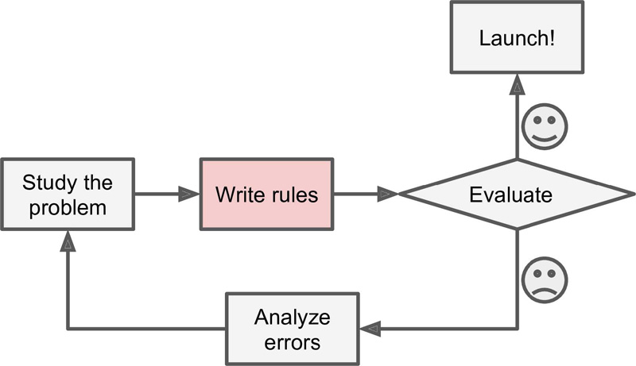
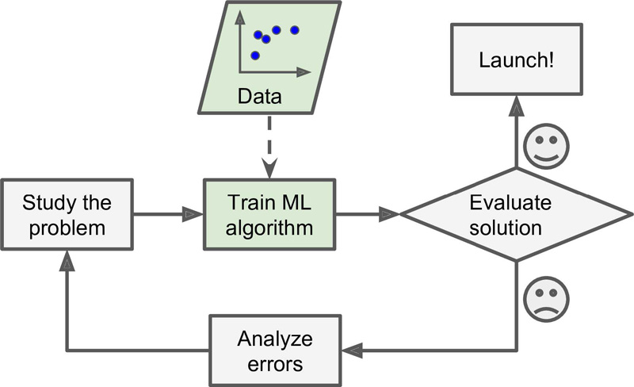
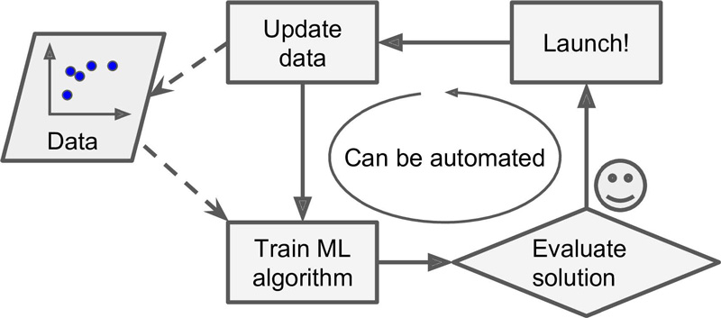

# What is machine learning?

Machine Learning is the science of `programming computers` with algorithms and statistical models to interprelate data, so usefull insight can extracted from data. The key concpet of algorithms and statistical models unsed in Machine learning today is it able to `learn`, `inference` and `decision-making` can be accomplished without explicit instructions from human. 

> Machine Learning is the field of study that gives computers the ability to `learn` without being explicitly programmed. - Arthur Samuel, 1959

> A computer program is said to learn from `experience E` with respect to some `task T` and some `performance` `measure P`, if its `performance on T`, as `measured by P`, improves with `experience E`. - Tom Mitchell, 1997

## Why use Machine Learning?

The traditional problem solving approach using set of rules to solve a problem, it's good for problems that have limited rules. But fot not trivial problmes, the program will likely become a long list of complex rules, thus pretty hard to maintain and develop.

In contrast, Machine Learning techniques automatically learns which patterns, rules applied in sample or data-set. So the program is much shorter, easier to maintain, and most likely more accurate.

Moreover, if new patterns/rules arrised in the new data set, the Machine Learning techniques automatically update the the system.

Another area where Machine Learning shines is for problems that either are too complex for traditional approaches or have no known algorithm. For example, speech recognition.

## Why is machine learning important?
Data is one of the most important assest for an business, it is the critical factor in leading decision making. But nowadays, companies collect data from various sources lead to data sea, which means it's very difficulte to find valueable insights from data sea. Machine learning is the reasearch to automates and optimizes this process of insight descovery by `learn` from data. Some key advantage for Machine Learning are:

* Problems for which existing solutions require a lot of hand-tuning or long lists of rules: one Machine Learning algorithm can often simplify code and perform better.
* Complex problems for which there is no good solution at all using a traditional approach: the best Machine Learning techniques can find a solution.
* Fluctuating environments: a Machine Learning system can adapt to new data.
* Getting insights about complex problems and large amounts of data.

# Types of Machine Learning Systems

There are so many different types of Machine Learning algorithms have been developed by researchers. There are few ways to classify them into distinct categories.

## Method 1: By input and expected output
This methods is to classify algorithms by the amount and type of supervision they get during training. Currently only four distinct learning styles.

### 1. Supervised Learning
Supervised refers to  Machine Learning algorithms are trained with data have labels. Data consists of input instances (vectors) and expected outputs, the expected outputs label can be continuous value(regression) or categorical (classification).

#### Example dataset
|  x1  |  x2  |   y   |
| ---  |:----:| -----:|
| 9.0  | 1.10 | true  |
| 7.1  | 20.1 | false |
| 3.2  | 1.90 | true  |

In here:
* `x1`, `x2`, `y` are features where `x1` and `x2` are input variables and `y` is expected output(label)
* [9.0, 1.10] is one of the input vector and `true` is the expexted output fot this vector

### 2. Unsupervised Learning

Oppsite to Supervised Learning, algorithms are trained without labels(no clear purpose). So the algorithm has to tries to make meaningful insights of the data by itself, therefore there's no guarantee what the result will be. Some common use of unsupervised learning are patterns recognition, anomaly detection, and automatically grouping data into categories.

#### Example dataset
|  x1  |  x2  |   y   |
| ---  |:----:| -----:|
| 9.0  | 1.10 | `   ` |
| 7.1  | 20.1 | `   ` |
| 3.2  | 1.90 | `   ` |

### 3. Semi-supervised Learning
To make it easy, the algorithms in method tries to learn from both labeled and unlabeled data. Usually a lot of unlabeled data and a little bit of labeled data used in algorithms. Semi-supervised learning is intersting is because it can use available unlabeled data to improve supervised learning tasks when the labeled data are scarce or expensive. 

#### Example dataset
|  x1  |  x2  |   y   |
| ---  |:----:| -----:|
| 9.0  | 1.10 | true  |
| 7.1  | 20.1 | `   ` |
| 3.2  | 1.90 | `   ` |

### 4. Reinforcement Learning

Supervised/unsupervised learning is where a learning agent is provided with data on which to base its learning. However learning is sometimes needed in less generous environments
* No `examples/data` provided
* No `model` of the environment
* No `utility function` at all!
  
The algorithms(agent) relies on feedback(rewward) about its performance by perform a certain task. So the agent's goal is to obtain the most reward for each strategy performed in an environment, and eventually it find best strategy in any state of an environment

## Method 2: By the Process to learn
This method is to classify algorithms by data feeding process to the algorithm.

### 1. Online learning

In online learning, you train the system incrementally by feeding it data instances sequentially, either individually or by small groups called mini-batches. Each learning step is fast and cheap, so the system can learn about new data on the fly, as it arrives.

### 2. Batch learning

In batch learning, the system is incapable of learning incrementally: it must be trained using all the available data. This will generally take a lot of time and computing resources, so it is typically done offline.

## Method 3: By how they generalize

* Whether they work by simply comparing new data points to known data points, or instead detect patterns in the training data and build a predictive model, much like scientists do

### 1. Instance-based Learning
Instance-based learning means that the algorithm memorizes all instances and generalizes to predict the labels of new instances by calculating the similarity between new instances and the remembered old ones. So Instance-based learning need to save entrie dataset in the model.

### 2. Model-based Learning
Model based learning algorithms use the training data to create a model that has parameters learned from the training data. For example linear regression, SVM. After the model is built, the training data can be discarded.

# Multilabel vs Multioutput-Multiclass Classification
| Tables                                | Number of class labels | Cardinality of each label |
| ------------------------------------- |:----------------------:| -------------------------:|
| Multiclass classification             | 1                      | > 2                       |
| Multilabel classification             | > 1                    | 2                         |
| Multioutput-multiclass classification | > 1                    | > 2                       |

# Main Challenges of machine learning
* Insufficient Quantity of Training Data
* Non-representative Training Data
* Poor-Quality Data(full of errors, outliers, and noise)
* Irrelevant Features
  * A critical part of the success of a Machine Learning project is coming up with a good. This process, called feature engineering involves:   
    * `Feature selection`: selecting the most useful features to train on among existing features.
    * `Feature extraction`: combining existing features to produce a more useful one
set of features to train on.
* Overfitting the Training Data
* Underfitting the Training Data
* Stepping Back
