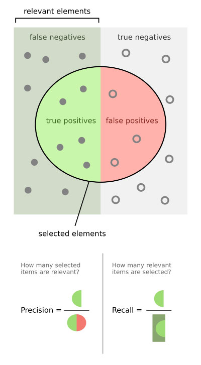

# Performance Measures
Measures Critique model perfromance

## Confusion Matrix
```
true positives (TP) are the cases that predicted True and actually True.
false positives (FP) are the cases that predicted True but actually False.
false negatives (FN) are the cases that predicted False but actually True.
true negatives (TN) are the cases that predicted False and actually False
```



Recall = proportion of positive instances that are correctly classified as positives

Prescicion = proportion

# The ROC(receiver operating characteristic) Curve
Similarly is the receiver operating characteristic (ROC) curve, which plots the true positive rate (TPR) against the false positive rate (FPR) for varying threshold settings.

TPR (also known as sensitivity and recall) = proportion of positive instances that are correctly classified as positives

    TP/(TP+FN)

TNR (also known as specificity) = proportion of negative instances that are
correctly classified as negatives

    TN/(FP+TN)

FPR = proportion of negative instances that are incorrectly classified as positives

    1 − specificity


# Performance Measures: Precision/Recall Tradeoff

# F1 score
Can be used for Multilabel Classification, 
