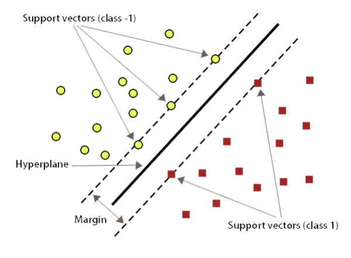
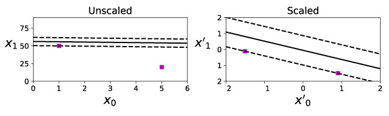
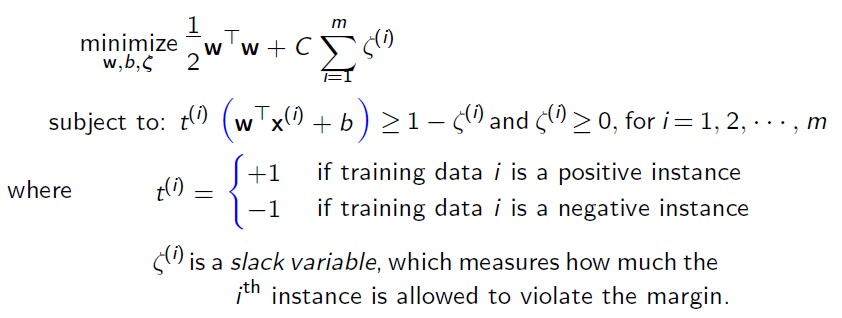
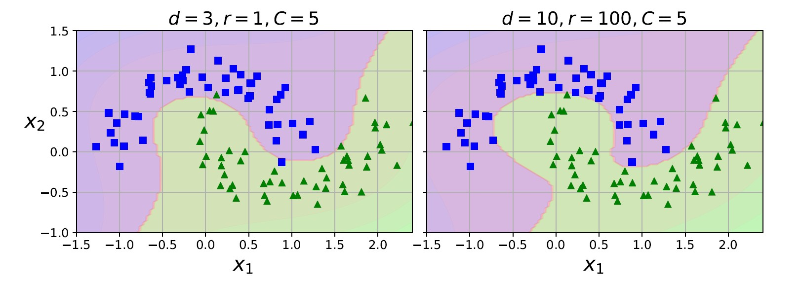
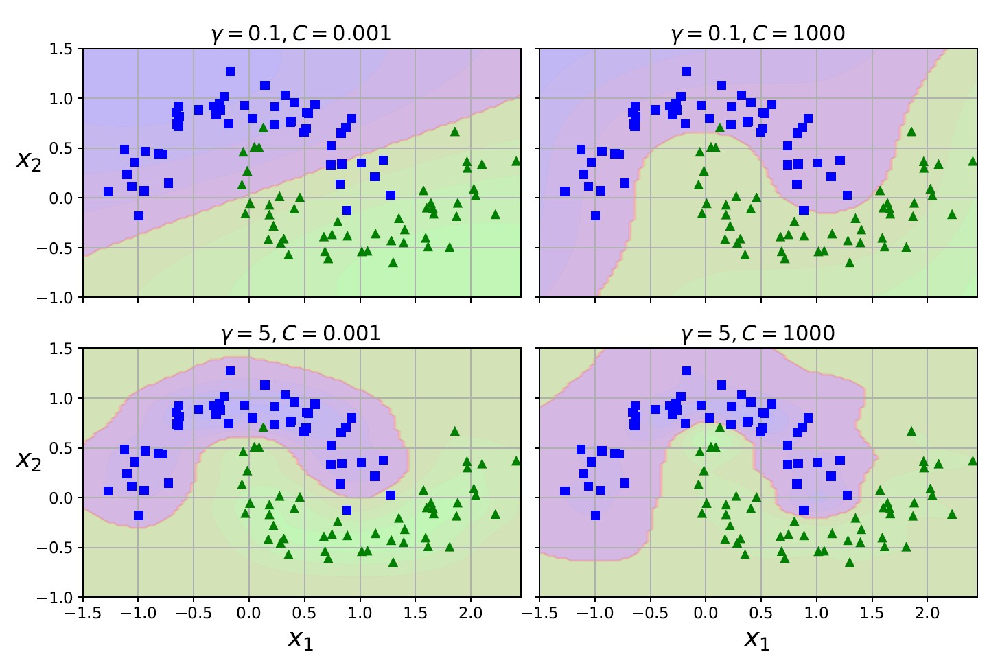

# Support Vector Machines - SVM

## Linear SVM Classification
SVMs are particularly well suited for classification of complex but small or medium sized datasets.

The fundamental idea behind SVMs fitting the widest possible street(`margin`) between the classes.

Notice that adding more training instances off the margin will not affect the decision boundary at all: it is fully determined (or “supported”) by the instances located on the edge of the street. These instances are called the support vectors.

### Sensitive to Scale
SVMs are sensitive to the `feature scales`. On the left plot, the vertical scale is much larger than the horizontal scale, so the widest possible street is close to horizontal. After feature scaling, the decision boundary looks much better.

### Hard Margin Classification
If we strictly impose that all instances be off the street and on the correct side, this is called hard margin classification.

However, hard margin classification only works if the data is linearly separable - not likely in `real` dataset.

### Soft Margin Classification
To avoid Hard Margin Classification issue we can use oft margin classification is to find a good balance between keeping the street as large as possible and limiting the margin violations:

Use the C hyperparameter to adjust the balance between the two objectives.

* A `small C` value `penalizes less` on the points falling onto the wrong side of the street, leading to more  margin violations.
* A large C value penalizes more on points falling onto the wrong side of the street, leading to less margin violations.

## Nonlinear SVM Classification
Dataset not always linear, one approach to handling nonlinear datasets is to add more features, such as polynomial features.

But using polynomial features is expensive. One solution is apply mathematical technique called the `kernel trick`. 

### `Polynomial Kernel`
As its name it add many polynomial features into the dataset, example 

### `Gaussian RBF Kernel`
Gaussian RBF Kernel is another technique to tackle nonlinear problems is to add features computed using a similarity function that measures how much each instance resembles a particular landmark.

## SVM Regression
Instead of trying to fit the largest possible street between two classes while limiting margin violations, SVM Regression tries to fit as many instances as possible on the street while limiting margin violations.

