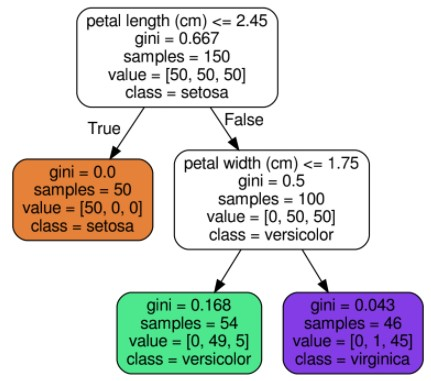
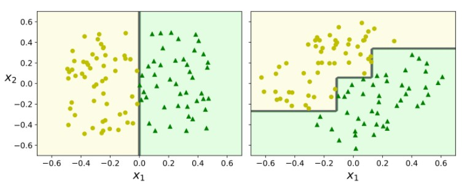
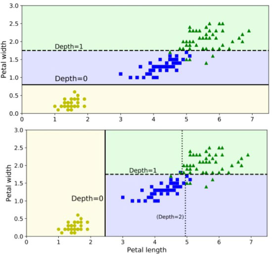

# Decision Trees
As it names, an algroithm based on tree. Example below

To make prediction, just by following the sequence of questions and answers down from the node, left or right depending on the answer.

When reached leaf node, use the probability from each class, pick the highest probability classes.

Advantage:
1. No need for data preprocessing such as standardization, feature scalling etc.
2. The generated rules from tree are easy to understand.
3. tolerant to data distribution, even missing, outlier values.

Disadvantages:
1. Easy to overfit-can be solved by pruning, setting the minimum size of leaf samples, and setting the maximum depth of the decision tree
2. Easy to fall into local optimum-can be solved by integrated learning
3. Sensitive to category imbalance

## Training Algorithm - (CART)
1. the algorithm first splits the training set in two subsets using a single feature `k` and a threshold tk (e.g., “petal length” ≤ 2.45 cm?).
2. To choose the `k`, it searches for the pair (k, tk) that produces the purest subsets (weighted by their size).
3. The cost function that the algorithm tries to minimize is given by
    * J(k,tk ) = Gleft + Gright

    Note: we use a Greedy Algorithm to get a reasonable solution, not necessarily optimal (which would take too long to find).

## Regularization Hyperparameters
DTs make few assumptions about the training data: they are thus referred to as nonparametric models, very (maybe too) adaptive.

To avoid overfitting, we need to restrict DTs’ freedom during training, e.g., using regularization or set the max depth hyperparameter smaller.Such as
* min samples split
* min samples leaf
* min weight fraction leaf
* max leaf nodes

By increasing or decreasing min and max hyperparameters regularizes the model.

## Instability:
#### Sensitivity to rotation

#### Sensitivity to small changes in data

# Terminology
### `Decision Stump` 
Is a Decision Tree with max depth=1 – a tree composed of a single decision node plus two leaf nodes.

# Gradient Boosting
