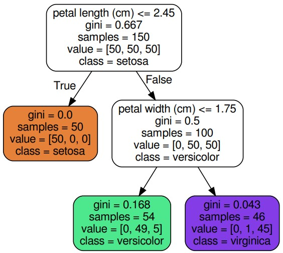
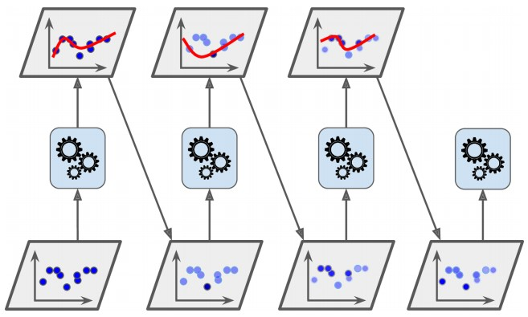
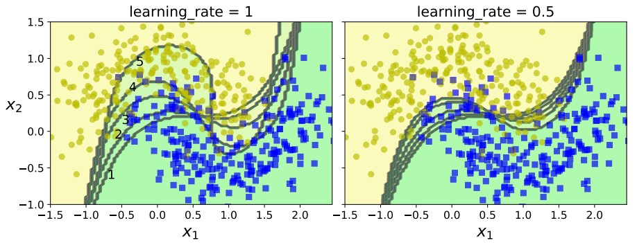
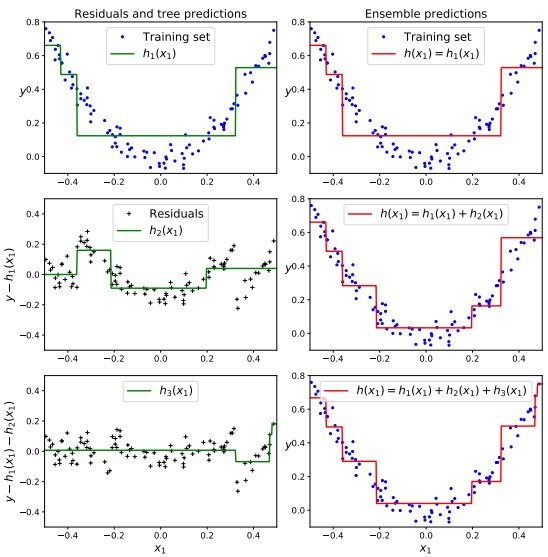
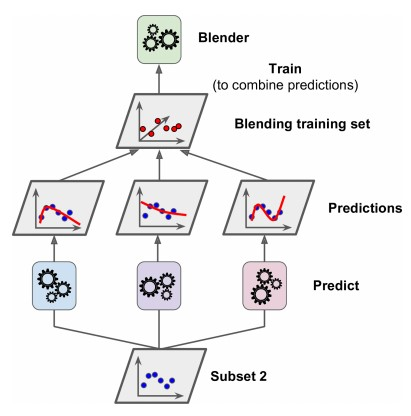

# Random Forests
Ramdon forests is an ensemble of Decision Trees, consists of a large number of individual decision trees. 

The RF algorithm introduces extra randomness when growing trees: instead of searching for the best feature when splitting a node (see previous topic), it searches for the best feature among the random subset of features.
* greater tree diversity (which trades a higher bias for a lower variance)
* generally yielding an overall better model.

# Extra Trees
It is possible to make a RF tree even more random by using random thresholds for each feature when splitting the node. It can `lower variance`, but `add bias`.

# Feature Importance
Feature importance generally used with feature selection, it measue how important is the feature `x` in this model.

In Scikit-Learn
1. collects all the nodes that used the feature x for node splitting;
2. computes the impurity reduction at each of these nodes, weighted by the number of training instances associated with the node;
3. computes the average impurity reduction over all these nodes.

Example


```python
# Petal Length
PetalLength = (0.667-0.0)*50 + (0.667-0.5)*100 # 50.05

# Petal Width
PetalLength = (0.5-0.168)*54 + (0.5-0.043)*46 # 38.95

Impotance_PetalLength = 50.05/(50.05+38.95) # 0.562 
Impotance_PetalLength = 38.95/(50.05+38.95) # 0.438
```

Gini impurity =  1 –  Gini

Gini = p(x<sub>1</sub>)<sup>2</sup> + ... + p(x<sub>n</sub>)<sup>2</sup> 

# Boosting
The general idea of most boosting methods is to train the predictors `sequentially`, each trying to `correct the predecessor`.

Common Boosting methods
### `AdaBoost`
Learning by adjust instances weight, can be examplined in three steps:
1. Initialize instinance weight
   1. Assuming there are N training sample data, each training sample is assigned the same weight at the beginning: w1=1/N.
2. The relative weights of the misclassified training instances are then increased. Vice versa for correctly classified training instances. The sample set with updated weights is used to train the next classifier, and the entire training process proceeds iteratively in this way.
3. Finally, the weak classifiers obtained from each training are combined into a strong classifier.
   * classifier with a low error rate adjust with larger weight in the final classifier, otherwise smaller. So bad classifier make less influence.




### Example below shows the decision boundary of consecutive
predictors on the moons dataset.




### `Gradient Boosting`
Instead of tweaking the instance `weights` at every iteration, it tries to fit the new predictor to the `residual errors` made by the previous predictor.

Unlike the AdaBoost classifiers, which can take any base estimator - SVC, SGDClassifier, etc, Gradient Boosting classifiers can only have `DecisionTreeClassifier` as the base estimator.

Residual error = An error is the difference between the observed value and the true value
```python
from sklearn.tree import DecisionTreeRegressor

# define and train the first regressor
tree_reg1 = DecisionTreeRegressor(max_depth=2)
tree_reg1.fit(X, y)
# define and train the second regressor on the residual errors
# made by the first predictor
y2 = y - tree_reg1.predict(X)
tree_reg2 = DecisionTreeRegressor(max_depth=2)
tree_reg2.fit(X, y2)
# repeat this for the third regressor
y3 = y2 - tree_reg2.predict(X)
tree_reg3 = DecisionTreeRegressor(max_depth=2)
tree_reg3.fit(X, y3)
# testing for a prediction
y_pred = sum(tree.predict(X_new) for tree in (tree_reg1,tree_reg2,tree_reg3))
```



Gradient Boosting is possible to implement early stopping by by setting `warm_start=True`, which makes Scikit-Learn keep existing trees when the fit() method is called, allowing incremental training.

Gradient Boosting can also specify the fraction of training instances for training each tree by setting subsamples appropriately - tradeoff between higher bias for a lower variance. But it can speeds up the training
considerably. This technique is called `Stochastic Gradient Boosting`.

### `Stacking`
Stacking is an idea that instead of using trivial functions (such as hard voting) to aggregate the predictions of all predictors in an ensemble. By train a model to perform this aggregation that may perfrom better.

To train the blender, a common approach is to use a hold-out set.

The main steps for implementing Stacking are:
1. Split the training data into 2 subsets: subset 1 and subset 2.
2. Use subset 1 to train the base predictors.
3. Use subset 2 to test the predictions produced by the predictors.
4. Using these predicted values as input features for blender.
5. Train the blender on this `new training set` to learn to predict the target values(Subset2 y values).




Some parameters from the StackingClassifier class:
* `estimators` – list of base estimators (strings or objects)
* `final estimator` that will be used to combine the base estimators.
* `stack method` – method to called for each base estimator for the stacking.
