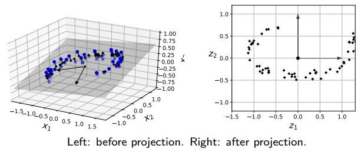
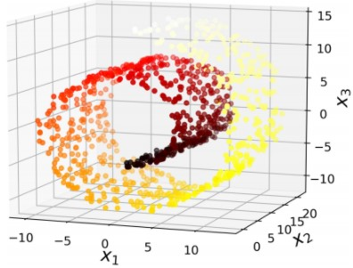

# Dimensionality Reduction

# The Curse of Dimensionality
Training instances in machine learning often have thousands or even millions of features. Which will taker longer to train, so harder to find a good solution.

Fortunately, in real-world problems, it is often possible to reduce the number of features considerably.

> Notes: Dimensionality Reduction will cause information lost in the data, so make your system perform slightly worse.

Apart from speeding up training, dimensionality reduction is also useful for data visualization. e.g. 4`D` to 3`D`

### `Why Dimensionality Reduction works`

Consider we have square, it's length is 1 unit, and we have a circle in inside the square and raduis 0.5. So
1. The area of the square is 1
2. The area of the circle is πr<sup>2</sup> = π0.5<sup>2</sup> ≈ 0.7854
3. The area difference is `0.2146` ≈ 22% probability to be outside the circle but inside the square

Now consider a unit cube and a sphere inside it.
1. The volume of the cube is 1
2. The volume of the sphere is <sup>4</sup>/<sub>3</sub> πr<sup>3</sup> = <sup>4</sup>/<sub>3</sub> π0.5<sup>3</sup> ≈ 0.5236
3. The volume difference is `0.4764` ≈ 48%

We can see the probability increased from `22%` to `48%`. As we increase the dimension say to a 10, 000-dimensional unit
hypercube, this probability increases to > `99.999999%`.

### `Continue Curse of Dimensionality`
A more troublesome difference is the average distance between points in high-dimensional space
* in 2D, it is roughly 0.52
* in 3D, it is 0.66
* in 1,000,000D, it is 408.25

> refer to `Euclidean Distance`

So with high dimensional datasets
* most training instances are likely to be far away from each other
* new instance is likely to be far away from any training instance, making prediction less reliable

In short, the more dimensions the training set has, the greater the risk of overfitting it

# Main Approaches for Dimensionality Reduction

## Projection
Inspect the data to see if they lie in a subspace of the high dimensional space.



Above graph showed alltraining instances lies closely on a plan, by project those instances onto  a new subspaces, we get a 2D dataset.

However, realword data not always have behavior like above graph. An example is the swiss roll dataset




## Manifold Learning
Manifold learning assumes that the data is a low-dimensional manifold uniformly sampled in a high-dimensional Euclidean space. So it tries restore the low-dimensional manifold structure from the high-dimensional sampled data. 

The problem with Manifold Learning is that ir rely on relies on `manifold assumption`. Which is an hypothesis that assume `data come from relatively low-dimensional`. 

Another implicit assumption is the classification or regression task will be simpler if the data are expressed in a lower-dimensional manifold.

> But, the decision boundary may not always be simpler with lower dimensions. Dimensionality Reduction will definitely speed up training but it may `not always lead to a better or simpler solution` – it all depends on the dataset.
## Principal Component Analysis (PCA)
PCA is by far the most popular DR algorithms. It is a `linear` dimensionality reduction technique. Firstly, it identifies the hyperplane that lies closest to the data. It then projects the data onto it.

> The key idea behind PCA is finding the projection matrix that would `preserve the variance` of the data as much as possible.


Basically from viewing we can see μ<sub>1</sub>'s variance is better then μ<sub>2</sub>

### `Steps in high dimension`

For a given n-dimensional dataset, PCA identifies
1. the first axis that accounts for the largest variance in the dataset
2. the second axis that is orthogonal to the first axis and that has the second largest variance
3. the third axis that is orthogonal to the first two axes and that has the third largest variance
4. and so on.


Thus, to determine the number of principal axes to keep is the same as to determine how many principal components to have after data projection

> Note: the direction of each PC axis is `not unique` (i.e., either direction is correct).
> 
> μ<sub>1</sub> can go to abother direction

### How to find the principal axes?
There is a standard matrix factorization technique called `Singular Value Decomposition (SVD)` that can decompose the training set X into three matrices U, Σ, and V:

Example in python
``` python
X_centered = X - X.mean(axis=0)
U, s, Vt = np.linalg.svd(X_centered)
c1 = Vt.T[:, 0]
c2 = Vt.T[:, 1]
```

### How to project the data?
In general, you would want to reduce the dimension from `n` to `d` by projecting the data onto the hyperplane defined by the first `d` principal axes while preserving as much variance of the data as possible

To do so, define an n × d matrix W<sub>d</sub> to contain the first d columns of matrix V. The projection is then simply:

X<sub>d-proj</sub> = XW<sub>d</sub>

Example in Scikit-Learn 3D to 2D
```python
from sklearn.decomposition import PCA
pca = PCA(n_components = 2)
X2D = pca.fit_transform(X) # handles the projection
```

### Explained variance ratio
It is important to find out the proportion of the dataset’s variance that lies along each principal component axis.

This is the explained variance ratio, available via the explained variance ratio variable:
```python
pca.explained_variance_ratio_
array([ 0.84248607, 0.14631839])
```

### Choosing the right number of dimensions
In generall, preferable to choose the number of dimensions that add up to a sufficiently large portion of the variance (e.g., 95%).

```python
pca = PCA(n_components=0.95)
X_reduced = pca.fit_transform(X)
```

Another option is to plot the explained variance as a function of dimensions (simply plot the cumsum). There will usually be an elbow in the curve, where the explained variance stops growing fast


## Incremental PCA
PCA require all data in memory, not applicable when dataset is too large. By useing `mini-batches`  to fed algorithm one
batches at a time will reduce the memory need dramatically.

```python
from sklearn.decomposition import IncrementalPCA
n_batches = 100
inc_pca = IncrementalPCA(n_components=154)
for X_batch in np.array_split(X_train, n_batches):
    inc_pca.partial_fit(X_batch)
X_reduced = inc_pca.transform(X_train)
```

## Randomized PCA
Randomized PCA is a stochastic algorithm which quickly finds an approximation of the first d principal component axes.  Its computational complexity is dramatically faster than the original algorithms.

## Kernel PCA
Recall that the `kernel trick` is a mathematical technique that implicitly maps instances into a very high-dimensional space called the feature space, allowing non-linear classification and regression to be done by linear techniques such as SVM.

This same trick can be applied to PCA, making it possible to perform complex nonlinear projections for dimensionality reduction. This is called `Kernel PCA`.

```python
from sklearn.decomposition import KernelPCA
rbf_pca = KernelPCA(n_components = 2, kernel="rbf", gamma=0.04)
X_reduced = rbf_pca.fit_transform(X)
```

### Selecting a kernel and tuning hyperparameters
As `Kernel PCA` is an unsupervised learning algorithm, there is no obvious performance measure to help you select the best kernel and hyperparameter values. We can work arround by select data and perfrom training

Example:
```python
from sklearn.model_selection import GridSearchCV
from sklearn.linear_model import LogisticRegression
from sklearn.pipeline import Pipeline
clf = Pipeline([
    ("kpca", KernelPCA(n_components=2)), # select features
    ("log_reg", LogisticRegression())    # perfrom training
])
param_grid = [{
    "kpca__gamma": np.linspace(0.03, 0.05, 10),
    "kpca__kernel": ["rbf", "sigmoid"]
}]

grid_search = GridSearchCV(clf, param_grid, cv=3) # Grid sross validation search
grid_search.fit(X, y)
```

Another approach, this time `entirely unsupervised`, is to select the kernel and hyperparameters that yield the `lowest reconstruction error`. However, reconstruction using kernel PCA is more complicated than using linear PCA. 


