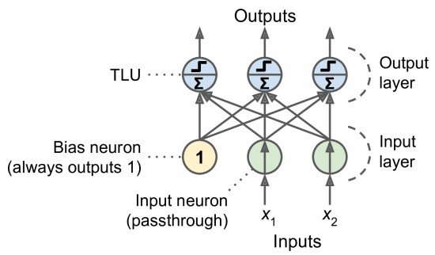
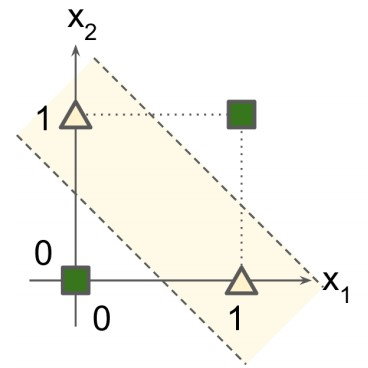
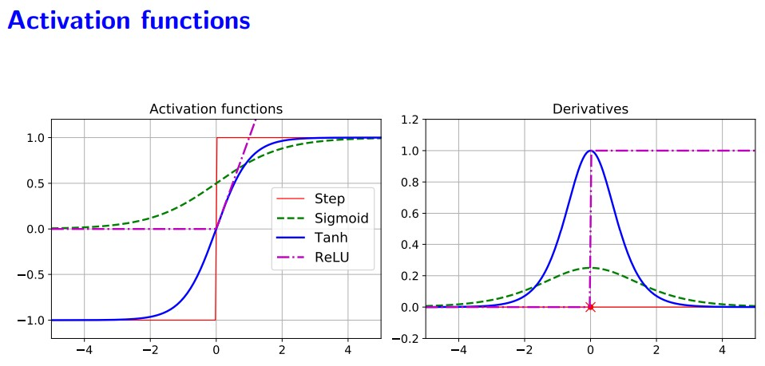

# Introduction to Artificial Neural Networks

## Perceptrons and threshold logic unit (TLU)
The Perceptron is one of the simplest ANN architectures. It is based on a slightly different artificial neuron called a `threshold logic unit (TLU)`, where the inputs and output are numbers (instead of binary on/off values) and each input connection is associated with a weight.

The TLU computes a weighted sum of its inputs:
```python
z = w1*x1 + ... + w*xn = xi*wi
```
Then apply a `step function` to that sum and outputs the result:

Example - Heaviside step function
```python
heaviside(z) = z < 0 ? 0 : 1
```

A single TLU can be used for simple linear binary classification, just like `binary Logistic Regression classifier`.

A Perceptron is simply composed of a single layer of TLUs with:
1. Input neurons - output whatever input they are passed in.
2. an extra bias feature `(x<sub>0</sub> = 1)`, which is typically represented using a special type of neuron called a `bias neuron`



### Computing the outputs
We can use linear algebra to improve the efficiency
> h<sub>W,b(x)</sub> = φ(x<sub>i</sub>W + b<sub>i</sub>)

* `x` represents the input feature
* `W` represents the unknown weight matrix which contains all the connection weights except bias neuron
* `b` is the bias vector containing all the connection weights between the bias neuron and the output neurons
* `φ` is called the activation function

## Training of a Perceptron and Hebb’s rule
Perceptron training use Hebb’s rule, which:
1. Perceptron is fed one training instance at a time, and for each instance it makes its predictions.
2. For every output neuron that produced a wrong prediction, it reinforces the connection weights from the inputs that would have contributed to the correct prediction.

> w'<sub>i,j</sub> = w<sub>i,j</sub> + η(y<sub>j</sub> − y'<sub>j</sub>) x<sub>i</sub>

* `w'`<sub>`i,j`</sub> is the weight between the input neuron(i) and the output neuron(j)
* `x`<sub>`i`</sub> is the i input value of the current training instance
* `y'`<sub>`j`</sub> is the predicted output of the output neuron(j) for the current training instance.
* `y`<sub>`j`</sub> is the actual output of the output neuron(j) for the current training instance.
* `η` is the learning rate

The decision boundary of each output neuron is linear, so Perceptrons (just like Logistic Regression classifiers) are incapable of learning complex patterns.

> Note: `Perceptrons` output predictions based on a hard threshold, while `Logistic Regression classifiers` output probability. Thus Logistic is more prefered against Perceptron

## Perceptrons and the XOR classification problem
Perceptrons requird the `decision boundary` of each output neuron to be `linear`(linearly separable). So not able to learn complex patterns. An example is `XOR`, example below:



However this is a problem for all linear classification model. 

A solution found, that by stacking multiple Perceptrons, the issue can be solved. Which called as `Multi-Layer Perceptrons (MLP)`

## Multi-Layer Perceptrons (MLP) and backpropagation
An MLP is composed by:
1. one input layer
2. one or more layers of `TLUs`, called hidden layers
3. one final layer of `TLUs` called the output layer

The backpropagation is Gradient Descent using reverse-mode autodif which:
1. Feeds it to the network and computes the output of every neuron in each layer
2. Measures the network’s output error(residual, mse, etc)
3. Goes through each layer in reverse order to measure the error contribution from each connection until the input layer is reached
4. finally slightly tweaks the connection weights to reduce the error - `Gradient Descent step`

## Commonly used activation functions
The step function won't work with Gradient Descent as the step function has `no gradient` to work with. Other function like `logistic`, `ReLU` has a well-defined nonzero derivative everywhere.
```Python
# logistic function: range(y) from −1 to +1
σ(z) = 1/(1 + exp(−z))

# hyperbolic tangent function: range(y) from −1 to +1
tanh(z) = 2σ(2z) − 1

# ReLU function
ReLU(z) = max(0, z)
```



## Training a deep neural network (DNN) using the Sequential API
...
## Fine-tuning neural network hyperparameters
Neural networks have many hyperparameters to tweak. We can use `GridSearchCV` or `RandomizedSearchCV` to explore the hyperparameter space. Other Python libraries like `Keras Tuner`, `Scikit-Optimize` can be used to fine tune hyperparameters as-well.

Below are some of the main hyperparameters

### `Number of Hidden Layers`
Increase the number of hidden layers until you start overfitting the training set. Generally start with one or two hidden layers.

For pre-trained model, we can reduce the number hidden layers

### `Number of Neurons per Hidden Layer`
Number of neurons in the input and output layers is determined by the type of input and output your task requires.

1. a common practice is to size them to form a pyramid, with fewer and fewer neurons at each layer - *common
practice today is to have the same number of neurons in each hidden layer*
2. increasing the number of neurons gradually until the network starts overfitting, then use early stopping and other regularization techniques to prevent it from overfitting

### `Activation Functions`
Most time use `ReLU` in `hidden layers` or one of its variants, should get a good result

For the `output layer`, the softmax activation function is generally a good choice for classification tasks when the classes are mutually exclusive.

When they are `not mutually` exclusive (or when there are just two classes), you generally want to use the `logistic function`. 

For `regression tasks`, you can simply use `no activation function` at all for the output layer.

### `Batch size`
Number of batch size determined by GPU RAM. however, in practice, large batch sizes often lead to training instabilities, especially at the start of the training (use `Learning rate warmup` to reduce the primacy effect).

### `Number of iterations`
In most cases, the number of training iterations does not actually need to be tweaked: just use early stopping instead.

### `optimizer`
Choosing a better optimizer than plain old Mini-batch Gradient Descent (and tuning its hyperparameters) is also quite important. Several advanced optimizers in [`Training Deep Neural Networks`](11.TrainDNN.md)

