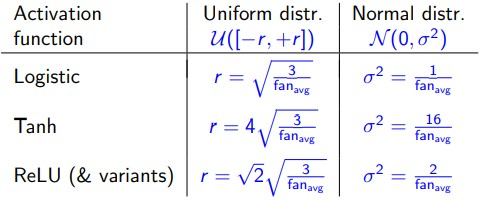
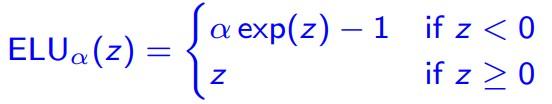
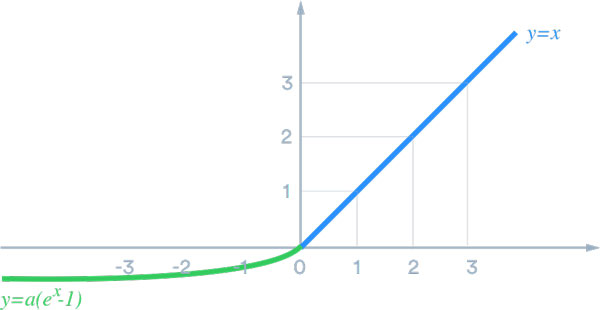
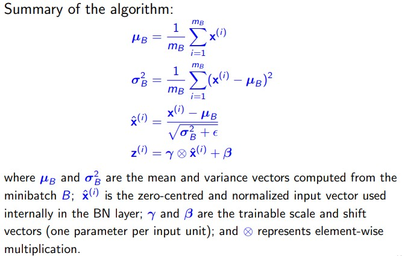
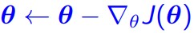
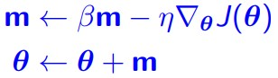
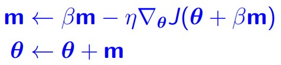
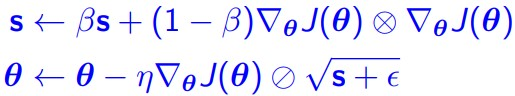
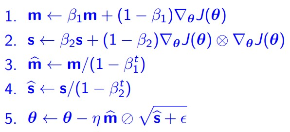

# Training Deep Neural Networks

## Problems in training DNNs
### `vanishing gradients & exploding gradients`
In training artificial neural networks with gradient-based learning methods and backpropagation, the neuron connection weight update depends on the partial derivative error contribution with respect to the current weight. 

The problem is that in some cases, the gradient will be vanishingly small, effectively preventing the weight from changing its value. 

This problem occures as backpropagation update the gradent of loss with respect to any given weight is the product of some derivatives that depends on lasyers in the deeper network. 
```python
# i is the current connection 
gradent=Ln·Ln-1·...·Li
```

Then if gradient will be exploding large, gradients become larger and larger, leading to the `exploding gradients problem`.

### Ways to solve
### `weight initialization techniques`
1. Glorot Initialization - Initialize connection weight randomly: two ways
   1. normal distribution with `mean 0` and variance σ<sup>2</sup>=1/(fan<sub>avg</sub>)
        * > fan<sub>avg</sub> = (fan<sub>in</sub> + fan<sub>out</sub>) / 2
        * where fan<sub>in</sub> is number of input neuron(unit), vice versa
   2. uniform distribution over the interval `[−r, +r]`, r = (3 / fan<sub>avg</sub>)^ 0.5
2. He Initialization - same as `Glorot` with slitely change to distribution formula



### `Nonsaturating Activation Functions`
The idea is simple if the derivative of the activation function do not fall into extreamly large or small, ie (`1`). The vanishing gradients & exploding gradients will not happen.

### *relu*
Does not saturate for positive values, but when the input to ReLU is negative it will output `0`, thus stop training - `dying ReLUs` 

> Can be partially solved by setting a small learning rate

### *leaky ReLU*
Used to overcome relu's dying neurons issue, by `max(αz, z)`.
* α is a small constant(α = 0.01).


### *Randomized leaky ReLU (RReLU)*
where α is picked randomly in a given range during training and is fixed to an average value during testing.

### *Parametric leaky ReLU (PReLU)*
that α is learned during training together with the connection weights

### *Exponential linear unit*




### *Scaled ELU*
as the name suggests, this is a scaled version of ELU

SELU has the self-normalization property, i.e. preserving the mean and variance of each layer’s output during training.

This property can be brokened if `L1` or `L2`, `dropout` and `non-sequential topology networks` is in use.

### Which activation function should you use?
In general, it is recommended to follow this order: `SELU` > `ELU` > `leaky ReLU (and its variants`) > `ReLU` > `tanh` > `logistic`.

If the network’s architecture prevents it from self-normalizing, then ELU may perform better than SELU

If runtime latency is an issue, then you may prefer leaky ReLU.

### `Batch Normalization`
Weight initialization techniques can mitigate the vanishing/exploding gradients problems at the beginning of training, it `doesn’t guarantee` that they won’t come back during training. 
* It add an extra operation before or after the activation function in each hidden layer to normalize the mean to 0 and the variance to 1.
* Introduces two trainable parameters, γ and β, that the training process must learn together with the connection weights.
* Mean and variance of each layer’s outputs for entire training set are estimated using the moving average of the minibatches. They are also used in the predictions on the testing set.



Advatage:
1. Act like a regularizer, reducing the need for other regularization techniques.
2. Remove the need for normalizing the input data.
3. Extra computations required at each layer, but it will take fewer epochs to reach the same performance.

### `Gradient Clipping`
Another popular technique to lessen the exploding gradients problem is to simply clip the gradients during backpropagation so that they never exceed some threshold. 

For example
```Python
'''
clip every component of the gradient vector to a value between −1.0 and 1.0
'''
optimizer = keras.optimizers.SGD(clipvalue=1.0)
model.compile(loss="mse", optimizer=optimizer)
```

# Faster Optimzers
Faster optimizer is used to boost training speed. We will look at 5 of the most popular algorithms:

### `Momentum optimization`
Weight update for Gradient Descent



We can see that if local gradient is tiny, it goes very slowly.

`Momentum optimization` trying to use a `momentum vector m` to track of gradients in the previous iterations. The vector `m` contains information about the past momentum. By use current gradient error as fine-tune to the momentum. It can speed up the training process.


```Python
optimizer = keras.optimizers.SGD(lr=0.001, momentum=0.9)
```

The `momentum(β)` is the new hyperparameter we need to adjust(usually set to 0.9). 

### `Nesterov accelerated gradient` variant of Momentum optimization
Nesterov measures the gradient of the loss function not at the local position θ but slightly ahead in the direction of the momentum, at `θ + βm`.



This small tweak works because in general the momentum vector will be pointing in the right direction (i.e., toward the
optimum), so the update ends up slightly closer to the optimum.

```Python
optimizer = keras.optimizers.SGD(lr=0.001, momentum=0.9, nesterov=True)
```

### `RMSProp`
In the RMSProp algorithm10, instead of the moment vector m, a vector s is used. The update equations are:



* where β < 1 (default value 0.9 works well)
* η are hyperparameters
* ε is a `small constant` to avoid division by 0
* operators ⊗ denote element-wise multiplication, another one is division.
* 
### `Adam optimization`
It combines the ideas of `Momentum` optimization and `RMSProp`. Instead of β, it has hyperparameters `β1 and β2`.


where `steps 3 and 4` are normalization to help increase the magnitude m and s as both vectors are initialized at around zero (so may be a bit small); t is the iteration number

Advantage:
* After bias correction, each iterative learning rate has a fixed range, which makes the parameters relatively stable.


### `Nadam optimization`
It is Adam optimization plus the Nesterov trick, so it will often converge slightly faster than Adam. So the algorithm involves both the m and s vectors.

Generally Nadam outperformed Adam, and Adam outperformed RMSProp.

# Learning rate scheduling
Finding a good learning rate is very important.  If you set it too high, training may diverge; if you set it too low, training too slow.

If you start with a large learning rate and then reduce it once training stops making fast progress, you can reach a good solution faster than with the optimal constant learning rate.

There are many different strategies to reduce the learning rate during training. It can also be beneficial to start with a low learning rate, increase it, then drop it again.

Example `Learning scheduler` are:
* Power scheduling
  * α/(1+e/s)
    * `e` is `epoch` and `s` is which `step`(each 10 step drop learning rate, etc).
* Exponential scheduling
* Performance scheduling
  * based on validation error every `N` steps, and reduce the learning rate by a factor of λ when the error stops dropping.
* 1Cycle scheduling
  * starts by increasing Learning rate linearly to a threadhold, then  decreases the learning rate linearly down to a threadhold

# Avoiding Overfitting

### `L1 and L2 Regularization`
L1 and L2 regularization to constrain a neural network’s connection weights. 
```Python
layer = keras.layers.Dense(100, activation="elu",
kernel_initializer="he_normal",
kernel_regularizer=keras.regularizers.l2(0.01)) #L2 Regularization
```

### `Dropout`
At each training step, every neuron has a probability p of being temporarily `dropped out` during training. However, it may be active during the next step.

In testing all neurons will be activated. 

