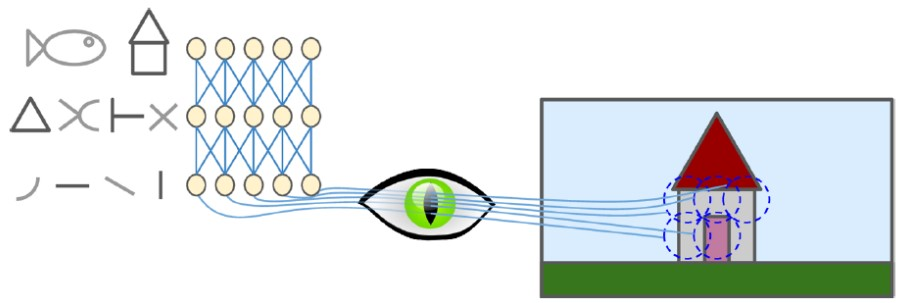
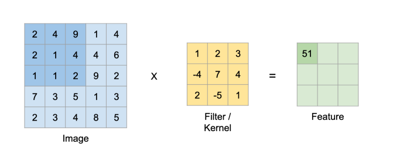
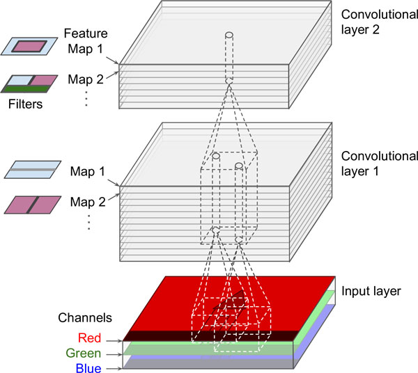

# Deep Computer Vision Using Convolutional Neural Networks
CNN emerged from the study of the brain’s visual cortex - neurons in the visual cortex respond to `specific patterns` in small regions of the visual field.



CNN can also apply to `voice recognition` or `natural language processing`
## Convolutional and Layers
Convolution layer works by connect a small retangle in the previous layer to a nrutons in next layers. This allows the network to locate slower-level features in first layer, then assemble into latger higher-level features in next hidden layers ans so on.

Example: Large input layers to much smaller layer by `spacing out` - stride, by shift from one recptive field to next.



    compute a dot product between filters and image
    2*1 + 4*2 + 9*3 + 2*(-4) + 1*7 + 4*4 + 1*2 + 1*(-5) + 2*1 = 51

The `Filter` values learned through back propogation.

In above example, we the frature size get strided by 1 pixel. 

Some time you may want to avoid stride, by adding padding to the images, which is a technique to simply add zeros around the margin of the image to increase it’s dimension.


## Filters

## Stacking Multiple Feature Maps
In pratical, convolutional layers stacked with multiple filters, and output one feature map per filter, so it is
more accurately represented in 3D.



* Within one feature map, all neurons share the same parameters.
* Neurons in different feature maps use different parameters.
* A neuron's receotive field is sane, but it extends accross all the previous layers' feature maps.
* In short, a convolutional layer simultaneously applies multiple filters to its inputs, making it capable of detecting multiple features anywhere in its inputs.

Specifically, if a convolutional layer has n filters, then there are n feature maps generated for that layer. A neurons located at row `i` col `j` in a convonlutional layers, then it connected to previous convonlutional layers neurons rows `i to ish + fh − 1` and col `j to jsw + fw − 1`

## How the convolution is done
p.15

# TensorFlow Implementation
* Each input image is typically represented as a 3D tensor of shape [height, width, channels]
* A mini-batch is represented as a 4D tensor of shape [minibatch size, height, width, channels]
* The weights of a convolutional layer (i.e., all the filters) are represented as a 4D tensor of shape [fh, fw , fn', fn], where fh and fw are the height of width of the filters, fn' is the number of channels (must be the same as the input image) of the filters, fn is the total number of filters.
* The bias terms of a convolutional layer are simply represented as a 1D tensor of shape [fn].

```Python
import numpy as np
from sklearn.datasets import load_sample_images

# Load sample images
china = load_sample_image("china.jpg")
flower = load_sample_image("flower.jpg")
images = np.array([china, flower])
batch_size, height, width, channels = images.shape

# Create 2 filters
filters = np.zeros(shape=(7, 7, channels, 2), dtype=np.float32)
filters[:, 3, :, 0] = 1 # vertical line
filters[3, :, :, 1] = 1 # horizontal line
outputs = tf.nn.conv2d(images, filters, strides=1, padding="SAME")
plt.imshow(outputs[0, :, :, 1], cmap="gray") # plot 1st image’s 2nd feature map
plt.show()
```

# Memory Requirements of CNNs
A problem with CNNs is that the convolutional layers require a huge amount of RAM, especially during training, because the reverse pass of backpropagation requires all the intermediate values computed during the forward pass.

Example:
```
Convolutional layer with 5 × 5 filters
the layer output 200 feature maps of size 150 × 100 with stride 1
input is a 150 × 100 RGB image

So:
(5 × 5 × 3 + 1) × 200 = 15200 paramaters to train
5 × 5 × 3 × 150 × 100 × 200 = 225000000 multiplications need to be done
150 × 100 × 200 × 4 = 12mb per instances. 
```

# Pooling Layers
Pooling layers is used to subsample the input image, that can reduce:
1. computational load
2. memory usage
3. number of parameters

Just like in convolutional layers, each neuron in a pooling layer is connected to the outputs of a limited number of neurons in the previous layer, located within a small rectangular receptive field.

In this layer you need to define:
1. the pooling size
2. stride
3. and the padding type

Pooling layers neuron has no weights, as ggregate the inputs using an aggregation function such as the max or mean.

### `Max pooling vs average pooling`
Average pooling allows more information to be preserved, while max pooling preserves only the strongest features.

Max pooling offers stronger `translation invariance` than average pooling, and it requires slightly less work to compute.

    translation invariance: Allow images to be classfied as same, even with small rotation, scale.

# CNN Architectures
Typical CNN architectures stack a few convolutional layers then a pooling layer, then another few convolutional layers , then
another pooling layer, and so on.

Near the output layer, a regular feedforward neural network is added, composed of a few fully connected layers, and the final layer outputs the prediction

A common mistake is to use convolution kernels that are too large, e.g., by stacking two convolutional layers with 3 × 3 kernels instead of using a layer with a 5 × 5 kernel, it will use fewer parameters (also less computations) and will usually perform better.

One exception is for the first convolutional layer: it can typically have a large kernel (e.g., 5 × 5), usually with a stride of 2 or more: this will reduce the spatial dimension of the image without losing too much information.

#### ` LeNet-5 Architecture`
#### ` AlexNet Architecture`

#### ` GoogLeNet Architecture`