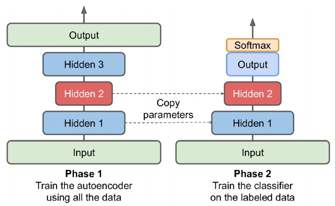
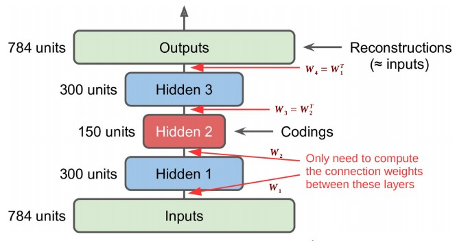
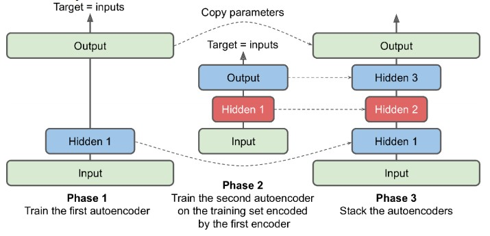

# Representation Learning and Generative Learning Using Autoencoders and GANs
# What are Autoencoders?
Autoencoders are artificial neural networks capable of learning efficient representations of the input data, called codings, without any supervision. These codings typically have a much lower dimensionality than the input data, making autoencoders useful for `dimensionality reduction`.

More importantly, autoencoders act as powerful `feature detectors`, and they can be used for unsupervised pre-training
of deep neural networks.

Lastly, some autoencoders are generative models: they are capable of randomly generating new data that looks very
similar to the training data. For example, you could train an autoencoder on pictures of faces, and it would then be able to generate new faces. However, the generated images are usually fuzzy and not entirely realistic.

To prevent the autoencoders from simply learning to copy their inputs to their outputs, we can constrain the network in various ways to make the task more difficult. For example:
* you can limit the size of the internal representation
* add noise to the inputs and train the network to recover the original inputs

These constraints prevent the autoencoder from trivially copying the inputs directly to the outputs, which forces it to learn efficient ways of representing the data.

`two type autoencoder`
1. undercomplete - limited the size of the coding layer
2. overcomplete - coding layer to be just as large as the inputs

### Efficient Data Representations
An autoencoder is always composed of two parts:
* an encoder (or recognition network) that converts the inputs to an internal representation, followed by
* a decoder (or generative network) that converts the internal representation to the outputs.
* Input layer neurons equals to output layer neurons

When the hidden layer less than the Input layers neurons, it force to learn the most important features in the input data - `dimensionality reduction`.


### Performing PCA with an Undercomplete Linear Autoencoder
If the autoencoder uses only `linear activations` and the cost function is the `Mean Squared Error (MSE)`, then it can be shown that it ends up performing `Principal Component Analysis`.

```Python
from tensorflow import keras
encoder = keras.models.Sequential([keras.layers.Dense(2, input_shape=[3])])
decoder = keras.models.Sequential([keras.layers.Dense(3, input_shape=[2])])
autoencoder = keras.models.Sequential([encoder, decoder])

autoencoder.compile(loss="mse", optimizer=keras.optimizers.SGD(lr=0.1))
```

## Stacked Autoencoders
Just like other neural networks, autoencoders can have multiple hidden layers - stacked autoencoders.

Adding more layers helps the autoencoder learn more complex codings. But do not to make the autoencoder too powerfull. 

Example:
* learns to map each input to a single arbitrary number
* Obviously such an autoencoder will reconstruct the training data perfectly, but it will not have learned any useful data representation in the process

The architecture of a stacked autoencoder is typically symmetrical with regards to the `central hidden layer`(*coding layer*).

```Python
stacked_encoder = keras.models.Sequential([
    keras.layers.Flatten(input_shape=[28, 28]),
    keras.layers.Dense(100, activation="selu"),
    keras.layers.Dense(30, activation="selu"),
])
stacked_decoder = keras.models.Sequential([
    keras.layers.Dense(100, activation="selu", input_shape=[30]),
    keras.layers.Dense(28 * 28, activation="sigmoid"),
    keras.layers.Reshape([28, 28])
])
stacked_ae = keras.models.Sequential([stacked_encoder, stacked_decoder])
stacked_ae.compile( loss="binary_crossentropy",
                    optimizer=keras.optimizers.SGD(lr=1.5))
                    history = stacked_ae.fit(X_train, X_train, epochs=10,
                    validation_data=[X_valid, X_valid])
```
### `Visualizing the Reconstructions`
One way to ensure that an autoencoder is properly trained is to compare the inputs and the outputs: the differences should not be too significant.

### `Visualizing Using T-SNE`
`T-SNE` is an  algorithm reduces the data down to 2D for visualization

### Unsupervised Pretraining Using Stacked Autoencoders
In some case, complex supervised task dont have a lot of training data. One solution is to find a neural network that performs a similar task and reuse its lower layers. As:
1. New neural network won’t have to learn all the low-level features
2. Just reuse the feature detectors learned by the existing network(ANN)

Similarly, we can firstly train a stacked autoencoder using all the data. This training process does not require the data to be labelled. Once the stacked autoencoder is trained, we can reuse its lower layers in our neural network for the actual task. As our neural network has fewer layers that require training, it can cope with fewer labelled training data



## Stacked Autoencoders: Tying the Weights
When an autoencoder is neatly symmetrical, like the one we just built, a common technique is to `tie the weights` of the decoder layers to the weights of the encoder layers. This halves the number of weights in the model, speeding up training and limiting the risk of overfitting.



## Training One Autoencoder at a Time
It is possible to train one shallow autoencoder at a time, then stack all of them into a single stacked autoencoder.

Example:



* Phase 1: The first autoencoder learns to reconstruct the inputs
* Phase 2: (i) we encode the whole training set using this first autoencoder
* Phase 3: Finally, we build a big sandwich using all these autoencoders.

## Convolutional Autoencoders
The encoder of a convolutional autoencoder is just a regular CNN composed of convolutional layers and pooling layers. It typically reduces the spatial dimensionality of the inputs (i.e., height and width) while increasing the depth (i.e., number of channels).

The decoder must do the reverse operation (upscale the image and reduce its depth back to the original dimensions), and for this you can use transpose convolutional layers (alternatively, you could combine upsampling layers with convolutional layers).

```Python
conv_encoder = keras.models.Sequential([
    keras.layers.Reshape([28, 28, 1], input_shape=[28, 28]),
    keras.layers.Conv2D(16, kernel_size=3, padding="same", activation="selu"),
    keras.layers.MaxPool2D(pool_size=2),
    keras.layers.Conv2D(32, kernel_size=3, padding="same", activation="selu"),
    keras.layers.MaxPool2D(pool_size=2),
    keras.layers.Conv2D(64, kernel_size=3, padding="same", activation="selu"),
    keras.layers.MaxPool2D(pool_size=2)
])
conv_decoder = keras.models.Sequential([
    keras.layers.Conv2DTranspose(32, kernel_size=3, strides=2, padding="valid",
    activation="selu", input_shape=[3, 3, 64]),
    keras.layers.Conv2DTranspose(16, kernel_size=3, strides=2, padding="same",
    activation="selu"),
    keras.layers.Conv2DTranspose(1, kernel_size=3, strides=2, padding="same",
    activation="sigmoid"),
    keras.layers.Reshape([28, 28])
])
conv_ae = keras.models.Sequential([conv_encoder, conv_decoder])
```

## Denoising Autoencoders
Used to learn input with noise, and training it to recover the original(noise-free). 

The noise can be pure Gaussian noise added to the inputs, or it can be randomly switched-off inputs, just like in dropout.

```Python
dropout_encoder = keras.models.Sequential([
    keras.layers.Flatten(input_shape=[28, 28]),
    keras.layers.Dropout(0.5),
    keras.layers.Dense(100, activation="selu"),
    keras.layers.Dense(30, activation="selu")
])
dropout_decoder = keras.models.Sequential([
    keras.layers.Dense(100, activation="selu", input_shape=[30]),
    keras.layers.Dense(28 * 28, activation="sigmoid"),
    keras.layers.Reshape([28, 28])
])
dropout_ae = keras.models.Sequential([dropout_encoder, dropout_decoder])
```

