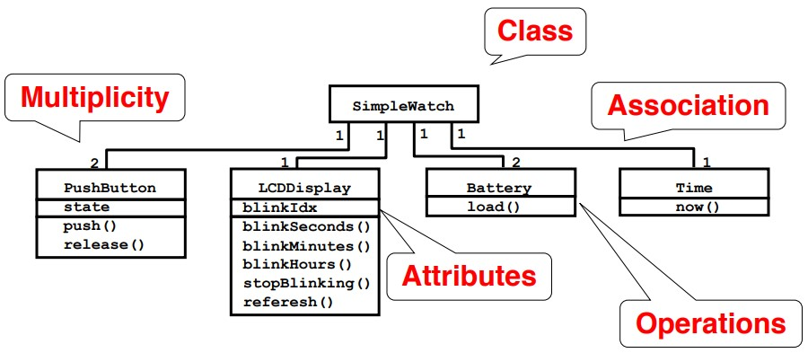
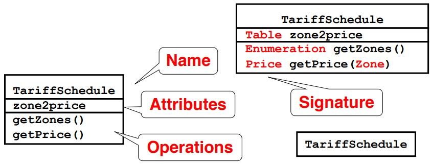
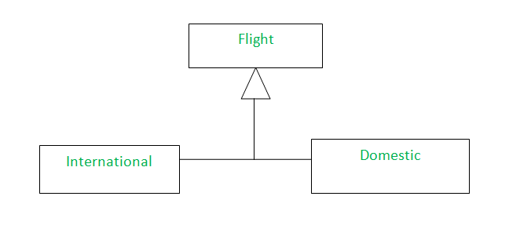

# UML class diagram


## Class Diagrams
Class diagrams represent the structure of the system.

Class diagrams are used
* during requirements analysis to model problem domain concepts
* during system design to model subsystems and interfaces
* during object design to model classes.

### Classes


A class represent a concept. That encapsulates state (attributes) and behavior (operations).

Each `attributes` has a `type` and Each `operation` has a `signature`.

The class name is the only mandatory information in the Class diagram.

### Associations
Associations denote relationships between classes 

### Multiplicity
The multiplicity of a property is an indication of how many objects may fill the property

``` python
1 # Exactly one
0..1 # One or zero
* # Zero or more
```

### Attributes
The attribute notation describes a property as a line of text within the class box itself.

### Attributes or Associations
`Attributes` for small things, such as dates or Booleans—in general, value types.

`Associations` for more significant classes, such as customers and orders.

### Generalization
A generalization is a form of abstraction where by `common properties` of specific instances are `formulated as general concepts` or claims. 

The children classes inherit the attributes and operations of the parent class. Thus it can eliminating redundancy.



### Constraints
Usually in if ... then ...;

# Class-Responsibility-Collaborator Model - CRC


CRC is a collection of standard index cards that have been divided into three sections, as depicted in above figure. 

A `class` represents a collection of similar objects

A `responsibility` is something that a class knows or does

A `collaborator` is another class that a class interacts with to fulfill its responsibilities.