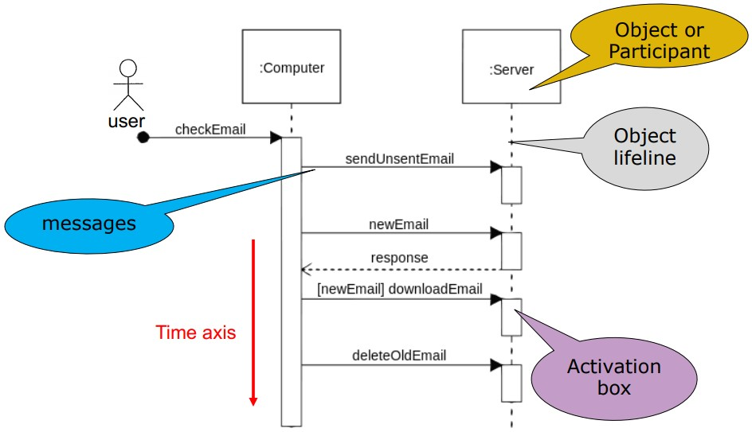
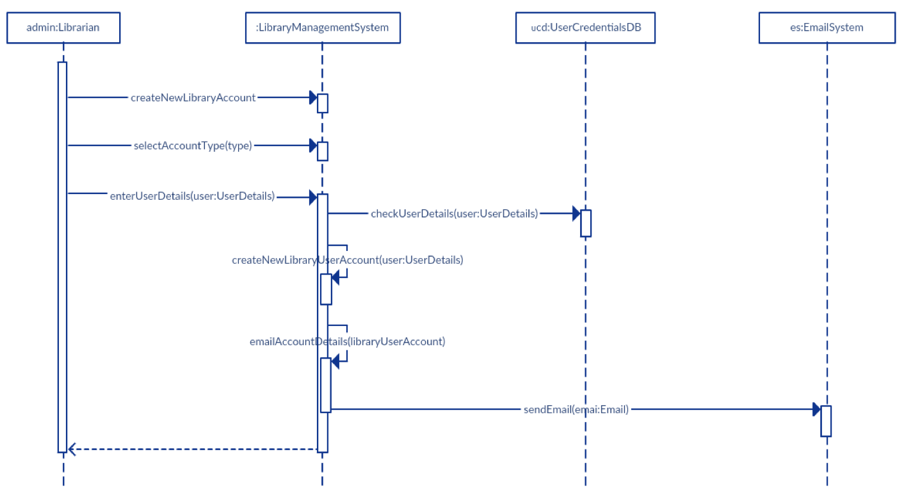
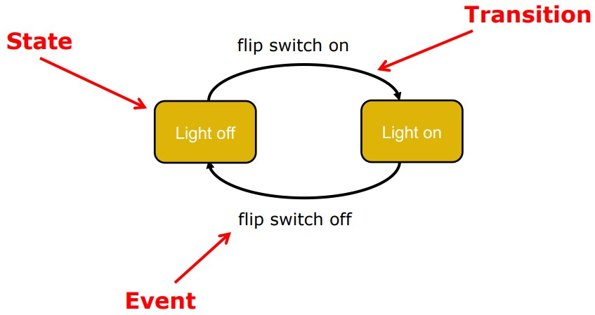

# Sequence Diagrams 
Interaction diagrams describe how groups of objects collaborate in some behaviour. The UML defines several forms of interaction diagram, of which the most common is the sequence diagram


Sequence diagrams represent
* the interaction of `participants` (horizontally)
* over `time` (vertically)
* using `messages` to communicate



Why sequence diagram:
  * Ties use cases with objects, showing how the behaviour of a use case is distributed amongst its participating objects
  * provide a shift in perspective, allowing developers to find missing objects or resolve uncertainties

The most important components in a sequence diagrams are:
1. Participating objects - what are the objects associated with the use case in consideration (Example above graph, `Computer` & `Server`)
2. Flow of events - messages that might be sent from the sender object to the receiver objects

### Conventions for Sequence Diagrams
Layout:
1. 1st column - `actor`
2. 2nd column - `boundary object`, which the actor interacts to initiate the case
3. 3rd column - `control object` that manages the rest of the use case
4. 4th column - `entity object` representing long-lived info tracked by the system

Object Creation:
1. `Control objects` are `created by` `boundary objects` initiating the use case
2. Other `boundary objects` are `created by` `control objects`

Object Access:
1. `Entity objects` are `accessed by` `control` and `boundary objects`,
2. `Entity objects` should `never access` `boundary` or `control objects`. This makes it easier to share entity objects across use cases and makes entity objects resilient against technology-induced changes in boundary objects.

## Example
```
The librarian requests the system to create a new online library account
The librarian then selects the library user account type
The librarian enters the user’s details
The user’s details are checked using the user Credentials Database
The new library user account is created
A summary of the of the new account’s details are then emailed to the user
```

Participants: librarian, system, Database, email

Events:
1. `librarian` requests the system create a new online library account
2. `librarian` selects the library user account
3. `librarian` enters the user’s details
4. check user detail
5. Create user account
6. send email



## When to use Sequence Diagrams
Use sequence diagrams when you want to look at the behavior of several objects within a single use case.

Sequence diagrams are good at showing collaborations among the objects, but not so good at precise definition of the behavior.

# State Diagrams


State diagram is a notation for describing the sequence of states an object goes through in response to external events. State diagram contain:
* A `state` is a condition satisfied by the attributes of an object
* A `transition` indicates a move from one state to another
* An `event` is a potential trigger for a change of state

> Note: State machine models show how `individual objects` change theirstate in response to events.

## When to use state diagram
State diagrams are good at describing the behavior of an object across several use cases.

# State Chart Diagram vs Sequence Diagram
State diagrams help to identify - Changes to objects over time

Sequence diagrams help to identify – The temporal relationships between objects over time. Sequence of operations as a response to one or more events

