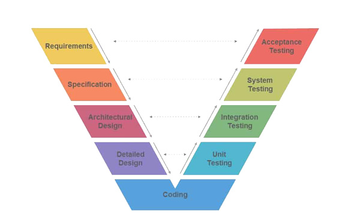

# What is Software quality
Software quality is an abstract concept to determine how well the software is by a set of measures. Generally, a **well** developed software in Software Engineer context have following properties
  1. Functionality fit the requirements.
  2. Maintainability
  3. Usability
  4. Scalability/Extensibility
  5. Reliability/Availability
  6. Securitability
  7. Portability

In order to ensuring the quality of a software, few general process can be followed,
1. Organisational Processes in mangeing software team
2. Process and Software Standards: by follow any standard, e.g. ISO compliance
3. Process Improvement
4. Requirements Specification
5. Formal Methods: mathematically method to verify a software
6. **Testing**

# What is Software testing
Software testing is systematic process to verifying the `correctness`, integrity, safety and quality of an implemented system, by finding `faults`. Which can be reasoned that by discover more faults in a system lead to more reliability system.

In general, techniques for improving reliability fall into three categories:
* `Fault avoidance` – Try to prevent faults not yet introduced into system
  * Use development methodologies - system design etc.
* `Fault detection` – Try to detect faults that have found in the system
  * Testing
* `Fault tolerance` – Ways of recovering from faults at runtime.
  * redundent system, etc.

### Key Terminology In Software testing
`Failure` -  It is the `inability` of a system or component to `perform` `required` `function` according to its specification.

`Error` - Refers to difference between Actual Output and Expected output.

`Fault` - Is a condition that causes the software to fail to perform its required function.

`Reliability` - Is the degree to which its `observed behaviour` conforms to its `specification`

`specification` - Describes what the code is supposed to do.

`implementation` - The actual embodiment in code that comprise the final product.

# Types of testing

## Unit testing
Unit testing is the lowest level of tests, it used to test a `single` `procedure`, `method` or `function`. A unit just means a component of code – typically a small one, but sometimes the term is used to refer to modules.

When we make an units test on a component, the aim is to o ensure it meets its `specifications`. Generally the specifications in wrote inside the `documenting units`.

> Documenting units - some way of documenting the specification of units inline, such as Javadoc, Pydoc etc.

    Unit tests should focus on one tiny bit of functionality, and attempt to find any deviations from expected behaviour

Properties of unit tests:
* quick to run - run tests whenever changes are made to the code, or at least when they are committed to version control.
* independent of other tests - Tests should not rely on other, particular tests having been run before them.
* Run frequently - Identify faults as early as possible!
  * Version control systems can perfrom test when code committed. But if tests aren’t quick to run, developers may avoid committing code regularly

### Unit-testing terminology
* test case – the basic unit of testing, which checks the behaviour of code in response to a particular set of inputs.
* test suite – a collection of test cases
* test runner – a software tool which manages the execution of tests, and reports their outcome
* test fixture – the preparation needed to perform one or more tests. The purpose of a test fixture is to ensure that there is a well known and fixed environment in which tests are run so that results are repeatable
  * Examples of fixtures:
    * Loading a database with a specific, known set of data
    * Erasing a hard disk and installing a known clean operating system installation
    * Copying a specific known set of files

What sort of behaviours might we expect from code under test?
* return of a value
* alteration of state
* throwing of an exception

Basically, the same things that we would document as postconditions.

Unit testing frameworks will typically provide ways of detecting all of these, and comparing them with expected results.

## Integration testing
Integration test is the process of intergate `units, classes, modules or other components`(modules) of a system together, then test the correctness of each module's interface with dependent module. Generally this is a step-by-step process, that modules are tested and intergated in an increamentlly order. 

Integration testing run less frequent than unit tests – e.g. if a unit is being changed, we might run integration tests once the unit tests are passing.

## Validation testing
May used after Integration test, to verify the functionlity fullfilled stakeholder's requirements under simulated environment. The advantage of this test is to identify failure ASAP, thus the cost of redevelopment can be reduced if the software does not meetthe software requirements.

## System tests
Under deployment environment, to test the software as a unit, and verify the software meet system requirements. This also included hardware, network, operator and other factors that relate to the software.

## Regression testing
Requirements change or failure will cause redevelopment on the functionality of the software, thus test need to to done again after any changes to check whether it still passes all relevant tests.
