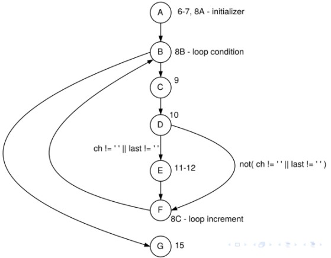

# Black-box testing
The sorts of unit tests we have seen so far: they are derived from the specifications for methods, and treat the method as a `black box` that takes in input and produces output, without considering how it does it.

``` Java
1 /** Remove/collapse multiple spaces.
2 *
3 * @param String string to remove multiple spaces from.
4 * @return String */
5 public static String collapseSpaces(String argStr)
```
    Specifications not only limited to methods, they can be software components, hardware, or whole systems

Advantages
* functionality that is specified but not implemented
* functionality that is implemented but incorrect

# White-box testing
Looking at the source code for a method, and ensuring that paths of execution through the method have been adequately tested.

```Java
/** Remove/collapse multiple spaces.
*
* @param String string to remove multiple spaces from.
* @return String */
public static String collapseSpaces(String argStr) {
    char last = argStr.charAt(0);
    StringBuffer argBuf = new StringBuffer();
    for (int cIdx = 0 ; cIdx < argStr.length(); cIdx++) {
        char ch = argStr.charAt(cIdx);
        if (ch != ' ' || last != ' ') {
            argBuf.append(ch);
            last = ch
        }
    }
    return argBuf.toString();
```

As we have the source code (or pseudocode), we can produce a `control flow graph`. By using the graph produce a set of tests for the given program.

#### `Control flow graph`
* nodes represent points in the program control flow can go “from” or “to”
* Loops, thrown exceptions and gotos (in languages that have them) are locations control flow can go from – statements representing these spots are “sources”
* Locations control flow can go to are “sinks”



#### `Why perform white-box testing`
1. Sometimes black box testing may failed to identity some particular scenario or specification not written fully.
2. Environment it system will change
   1. Previously `dead code`(never executed) might now become `live` - may contain errror 

# Model-based testing

### `Functions`
If we can treat the model as a function from inputs to outputs – then we can apply input-space partitioning to it.

Example:
* Unit tests based on Javadoc specification
* System testing based on specifications
### `Graphs`
If we can treat the model as a graph – a network of nodes – then we can apply graph-based techniques to it.

Example: 
* Control flow analysis
* State diagrams
* Activity diagrams
### `Logic`
If particular parts of the system make “choices” based on combinations of logical conditions, we can apply logic-based techniques to it.

Example:
* Avionics systems are required to have a particular level of coverage of logic expressions

### `Syntax`
If the model can be treated as having a “syntax” (a sort of tree-like, potentially recursive structure), then we can apply syntax-based techniques to it.

Example:
* natural language sentences
### `logic vs graphs`
Graph-based techniques look at what edges we traverse between nodes, they don’t look “inside” the nodes

By contrast, logic-based testing looks “inside” the parts of boolean expressions making up a “decision point”, and asks whether we’ve tested those parts sufficiently thoroughly.

## State diagram
State diagrams show states something can be in, and transitions between them.

## Activity diagrams
modelling a user’s interactions with a system.
