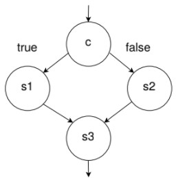
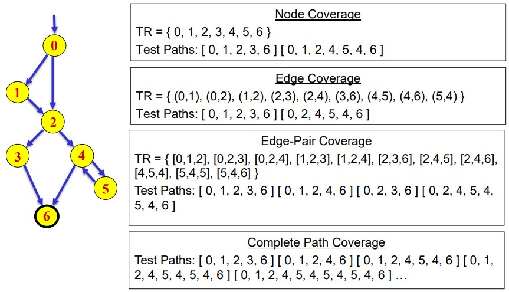
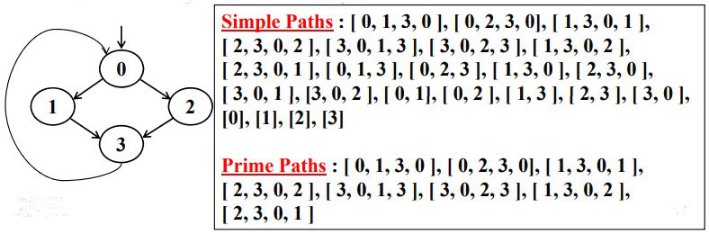

# Graph-based testing
Graph-based testing – we identify inputs which will exercise particular paths through a graph representing the software in some way.

The `graph` could represent
* `control flow` - Captures information about how the control is transferred in a program
* `data flow` between variables
* an `activity diagram`, showing the workflow when a user interacts with the system
* a `state diagram`, showing states of a system and transitions between them

## Graph
A graph consists of a set of nodes `N` and edges `E` that connect pairs of nodes.

## Graph-based testing
We will use control flow graph as an example, with source code (or pseudocode) to produce a control flow
graph. The we use the graph produce a set of tests for the given program.

### Constructing the graph
In a control flow graph, nodes represent points in the program control flow can go “from” or “to”

Loops, thrown exceptions and gotos (in languages that have them) are locations control flow can go from – statements representing these spots are `sources`

```python
if c then:
    s1
else:
    s2
s3
```



## Graph-based testing - testing criteria
Some possible criteria include:
* node coverage - our test set traverses every node
* edge coverage - we traverse every edge
* egde-pair coverage - we traverse every possible pair of edges



### Prime path
Simple Path: A path from node n<sub>i</sub> to n<sub>j</sub> is simple if no node appears more than once, except possibly the first and last nodes are the same
* No internal loops in our path
* A loop is a simple path

Prime Path : A simple path that does not appear as a proper subpath of any other simple path

Example:


### Prime path coverage
Prime Path Coverage (PPC): Every prime path in the graph is visited.

It subsumes node and edge coverage

But not edge-pair coverage – when code have nodes (m,n), where m loops to itself, and edge pair coverage requires the path (m,m,n) to be exercised.

when it comes to devising tests, some tests may end up exercising `multiple prime paths`. But that’s okay – as long as all prime paths are visited, we’ve satisfied the criterion.

### Control flow graphs coverage
In a control flow graph, different graph coverage criteria will correspond to:
* Node coverage: Execute every statement (in fact, node coverage is stronger, since one statement may expand to multiple nodes)
* Edge coverage: Execute every branch