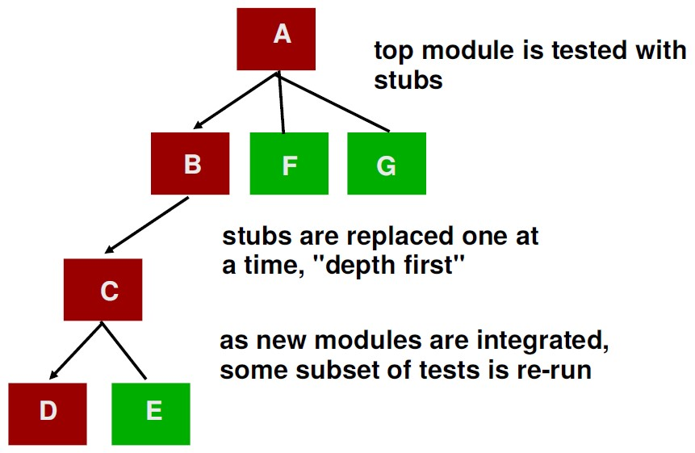
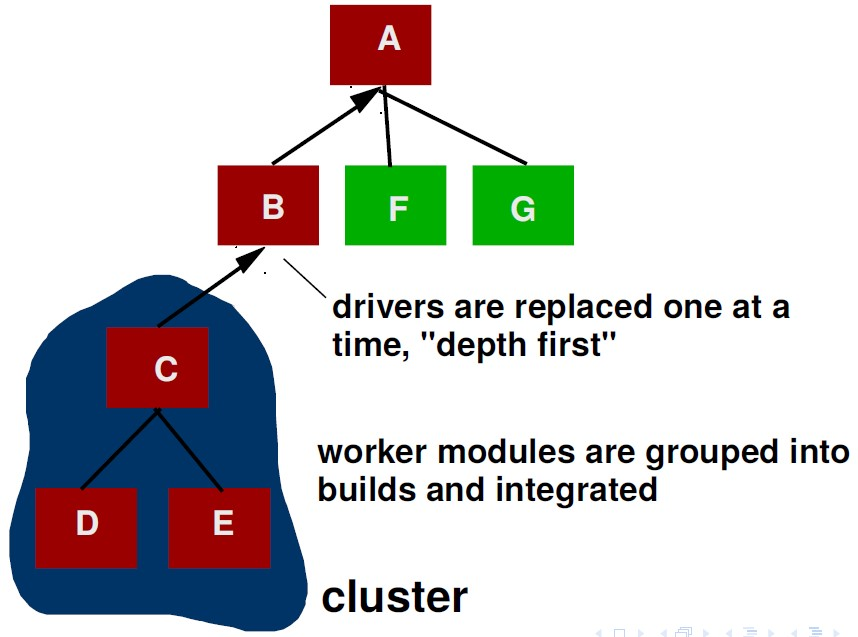
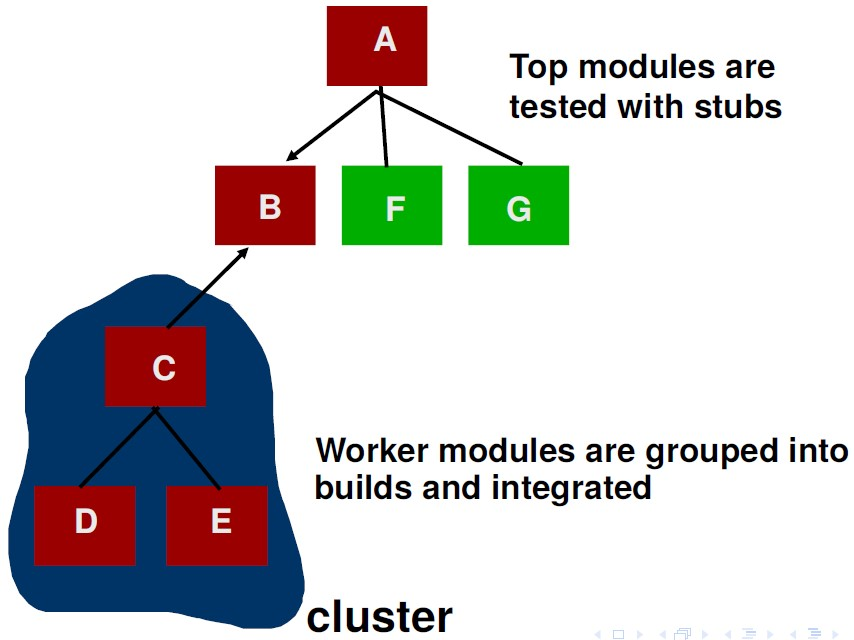

Typically we start `testing in small` and move toward `larger testing`

Start with units (functions/classes) -> System test

# Intergation testing
Integration testing is a level of software testing where individual units / components are combined and tested as a group. 

The purpose of this level of testing is to expose faults in the interaction between integrated units.

The order in which the subsystems are selected for testing and integration determines the testing strategy

## Integration testing strategies

### Big Bang
`All` or `most` of the units are `combined` together and tested at one go.

This approach is taken when the testing team receives the entire software in a bundle.

The difference between `Big Bang Integration Testing` and `System Testing` is `Big Bang` test interactions between the units while the `System` tests the functionalities in the entire system.

### Top Down
This is an approach to Integration Testing where top-level units are tested first and lower level units are tested step by step after that.

This approach is taken when top-down development approach is followed.

Test Stubs are needed to simulate lower level units which may not be available during the initial phases.

Pros
* Test cases can be defined in terms of the functionality of the system

Cons
* Writing stubs can be difficult: Stubs must allow all possible conditions to be tested.
* Possibly a very large number of stubs may be required, especially if the lowest level of the system contains many methods.
* One solution to avoid too many stubs: Modified top-down testing strategy
  * Test each layer of the system decomposition individually before merging the layers
  * Disadvantage of modified top-down testing: Both stubs and drivers are needed

### Bottom-Up
This is an approach to Integration Testing where bottom level units are tested first and upper-level units step by step after that. 

This approach is taken when bottom-up development approach is followed. 

Test Drivers are needed to simulate higher level units which may not be available during the initial phases.

Pros
* Systems tested as they are ready

Cons
* Typically tests one important subsystem (UI) last

#### When to use

### Sandwich/ Hybrid
This is an approach to Integration Testing which is a combination of Top Down and Bottom Up approaches.

## Steps in integration testing
1. Based on the integration strategy, select a component to be tested. Unit test all the classes in the component.
2. Put selected component together; do any preliminary fix-up necessary to make the integration test operational (drivers, stubs)
3. Do functional testing: Define test cases that exercise all uses cases with the selected component
4. Do structural testing: Define test cases that exercise the selected component
5. Execute performance tests
6. Keep records of the test cases and testing activities.
7. Repeat steps 1 to 7 until the full system is tested.

The primary goal of integration testing is to identify errors in
the (current) component configuration.

## Bottom up VS Top down
Bottom up approach
* good for object oriented design methodologies
* Test driver interfaces must match component interfaces
* Top-level components are usually important and cannot be neglected up to the end of testing
* Detection of design errors postponed until end of testing

Top down approach
* Test cases can be defined in terms of functions examined
* Need to maintain correctness of test stubs
* Writing stubs can be difficult

# Regression testing
Regression Testing is defined as a type of software testing to confirm that a recent program or `code change` has not adversely `affected existing features`.

Regression Testing is nothing but a full or partial selection of already executed test cases which are re-executed to ensure existing functionalities work fine.

# Smoke Testing
A test suite that covers the main functionality of a component or system to determine whether it works properly before planned testing begins.

# Other sorts of testing
* Validation testing
  * Focus is on software requirements
System testing
  * Focus is on integration of sub-systems
Alpha/Beta testing
  * Focus is on customer usage
  * Alpha testing = done by employees of development organisation, simulates typical use tasks
  * Beta testing = done by releasing to a limited number of real users
* Recovery testing
  * forces the software to fail in a variety of ways and verifies that recovery is properly performed
* Security testing
  * verifies that protection mechanisms built into a system will, in fact, protect it from improper penetration
* Stress testing
  * executes a system in a manner that demands resources in abnormal quantity, frequency, or volume
* Performance Testing
  * test the run-time performance of software within the context of an integrated system